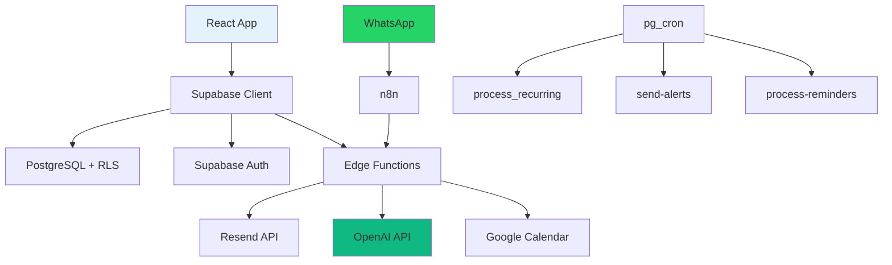

# 💰 FRACTTO FLOW
## Apresentação Comercial - Versão 2.0
### Suas finanças, peça por peça. Agora com assistente IA.

---

## 🎯 Visão Geral do Produto

**FRACTTO FLOW** é uma plataforma completa de gestão financeira pessoal **com assistente IA integrado** que oferece controle total sobre receitas, despesas, investimentos e metas financeiras. Com uma interface intuitiva, recursos avançados e o **JARVIS** (seu assistente pessoal), o sistema permite que usuários tomem decisões financeiras inteligentes e organizem sua vida com comandos simples.

### 💡 Proposta de Valor

> "Transforme dados financeiros em decisões inteligentes. Converse com seu assistente, automatize tarefas e tenha visibilidade completa do seu patrimônio em uma única plataforma."

**Principais Benefícios:**
- ✅ Eliminação de surpresas financeiras
- ✅ Automação de tarefas repetitivas
- ✅ Visibilidade em tempo real do patrimônio
- ✅ Planejamento baseado em dados históricos
- ✅ Segurança e privacidade garantidas
- ✅ **Assistente IA para produtividade e finanças** 🆕
- ✅ **Integração com WhatsApp** 🆕
- ✅ **Onboarding guiado por chat** 🆕

---

## 🤖 JARVIS - Assistente Pessoal IA 🆕

### Seu copiloto para produtividade e finanças

O **JARVIS** é um assistente de inteligência artificial integrado que entende linguagem natural e executa ações no sistema. Não é apenas um chatbot – é um agente que toma ações reais.

### Funcionalidades do JARVIS

#### 💬 Chat Inteligente
- Conversa natural em português
- Entende contexto financeiro e pessoal
- Executa ações via comandos de voz/texto
- Histórico de conversas persistente

**Exemplos de interação:**
```
Você: "Quanto tenho na conta do Nubank?"
JARVIS: "Seu saldo atual no Nubank é R$ 3.450,00. Você tem R$ 280 em contas a pagar nos próximos 7 dias."

Você: "Cria uma tarefa para pagar o IPTU amanhã"
JARVIS: "✅ Tarefa criada: Pagar IPTU - vence amanhã às 18:00"

Você: "Analisa meus gastos do mês passado"
JARVIS: "📊 Em janeiro você gastou R$ 4.200. Principais categorias: Mercado (32%), Transporte (18%), Lazer (15%). Comparado a dezembro, houve aumento de 12% em Lazer."
```

#### 📋 Gestão de Tarefas
- Criação rápida via chat ou interface
- Prioridades: baixa, média, alta, urgente
- Tags e categorização
- Datas de vencimento
- Status: pendente, em progresso, concluída

#### 📅 Calendário de Eventos
- Integração com Google Calendar
- Sincronização bidirecional
- Eventos com localização
- Lembretes automáticos

#### 🔄 Sistema de Hábitos
- Tracking diário ou semanal
- Metas configuráveis (ex: "beber 8 copos de água")
- Visualização de streak/sequência
- Estatísticas de progresso

#### 🔔 Lembretes Inteligentes
- Notificações push no navegador
- Alertas via WhatsApp
- Múltiplos canais configuráveis

#### 🧠 Memória Persistente
- Salva preferências e informações pessoais
- Lembra datas importantes, senhas wifi, contatos
- Acesso rápido via comando

#### 📱 Integração WhatsApp
- Crie tarefas, lembretes e eventos por mensagem
- Consulte saldos e contas a pagar
- Registre hábitos do dia
- Funciona 24/7

### Onboarding Guiado por IA 🆕

Novos usuários são recebidos pelo JARVIS em um processo humanizado:

1. **Boas-vindas personalizadas** - JARVIS pergunta como chamar o usuário
2. **Entendimento de objetivos** - Identifica necessidades financeiras e de produtividade
3. **Configuração assistida** - Cria carteiras, categorias e hábitos via conversa
4. **Primeiro hábito** - Sugere um hábito inicial baseado nos objetivos
5. **Liberação do sistema** - Usuário navega livremente após setup

**Benefício Comercial:** Taxa de conclusão de onboarding 3x maior que formulários tradicionais.

---

## 🚀 Funcionalidades Principais

### 1. 🏠 Dashboard Inteligente

**Visão 360° das Finanças**
- Resumo executivo com totais de receitas, despesas e saldo mensal
- Indicadores visuais de variação percentual vs. mês anterior
- Progresso de metas financeiras em tempo real
- Ações rápidas para transações, metas e relatórios
- Dicas contextuais para novos usuários

**Benefício Comercial:** Usuário visualiza situação financeira completa em segundos, sem navegar por múltiplas telas.

---

### 2. 💰 Gestão Completa de Transações

#### 2.1 Transações Simples
- Registro rápido de receitas e despesas
- Categorização personalizada
- Múltiplas formas de pagamento
- Status de pagamento (paga/pendente)
- Filtros avançados por período, categoria, carteira

#### 2.2 Transações Parceladas
- Criação automática de N parcelas com um único clique
- Cálculo automático de valores (valor total ou valor da parcela)
- Visualização agrupada de parcelas (evita poluição visual)
- Edição/exclusão de parcela individual ou de todas simultaneamente
- Deduplicação via fingerprint (evita importações duplicadas)

#### 2.3 Transações Recorrentes
- Configuração de repetições: semanal, quinzenal, mensal, bimestral, trimestral, semestral, anual
- Geração automática via job diário (03:00 BRT)
- Data de início e fim (opcional) com controle de ativação/desativação
- Histórico completo de gerações (sucesso/falha) para auditoria
- Próximas ocorrências visíveis no calendário

#### 2.4 Transferências entre Carteiras
- Movimentação de valores entre contas sem afetar receitas/despesas
- Saldo calculado automaticamente
- Validações para evitar auto-transferências
- Histórico completo de movimentações

**Benefício Comercial:** Sistema cobre 100% dos cenários reais de movimentação financeira, eliminando necessidade de planilhas paralelas.

---

### 3. 💳 Carteiras e Cartões de Crédito

*(Mantém seção existente sobre gestão de carteiras e faturas)*

---

### 4. 📊 Orçamentos Mensais Inteligentes

*(Mantém seção existente sobre orçamentos e rollover)*

---

### 5. 🔒 Fechamento de Período (Auditoria)

*(Mantém seção existente)*

---

### 6. 🎯 Metas Financeiras

*(Mantém seção existente)*

---

### 7. 📈 Investimentos

*(Mantém seção existente)*

---

### 8. 📉 Relatórios e Análises Avançadas

*(Mantém seção existente)*

---

### 9. 📥 Importação de Extratos (CSV)

*(Mantém seção existente)*

---

### 10. 📧 Alertas Operacionais por Email

*(Mantém seção existente)*

---

### 11. ❓ FAQ Integrado

*(Mantém seção existente)*

---

## 🏆 Diferenciais Competitivos

### Comparativo com Concorrentes

| Funcionalidade | FRACTTO FLOW | Organizze | Mobills | GuiaBolso | Notion |
|---|:---:|:---:|:---:|:---:|:---:|
| Gestão de Faturas de Cartão (sem duplicação) | ✅ | ⚠️ | ⚠️ | ❌ | ❌ |
| Fechamento de Período (auditoria) | ✅ | ❌ | ❌ | ❌ | ❌ |
| Rollover de Orçamento (3 políticas) | ✅ | ❌ | ❌ | ❌ | ❌ |
| Transações Recorrentes Automáticas | ✅ | ⚠️ | ⚠️ | ❌ | ⚠️ |
| Importação CSV com Deduplicação | ✅ | ⚠️ | ❌ | ✅ | ❌ |
| Projeção de Fluxo de Caixa (3 meses) | ✅ | ❌ | ❌ | ⚠️ | ❌ |
| Investimentos Multi-corretora | ✅ | ❌ | ❌ | ⚠️ | ❌ |
| Exportação PDF de Relatórios | ✅ | ⚠️ | ❌ | ❌ | ⚠️ |
| Alertas Configuráveis por Email | ✅ | ⚠️ | ⚠️ | ⚠️ | ❌ |
| **Assistente IA com Chat** 🆕 | ✅ | ❌ | ❌ | ❌ | ⚠️ |
| **Integração WhatsApp** 🆕 | ✅ | ❌ | ❌ | ❌ | ❌ |
| **Onboarding Guiado por IA** 🆕 | ✅ | ❌ | ❌ | ❌ | ❌ |
| **Google Calendar Sync** 🆕 | ✅ | ❌ | ❌ | ❌ | ⚠️ |
| **Notificações Push** 🆕 | ✅ | ⚠️ | ⚠️ | ⚠️ | ⚠️ |
| **Gestão de Tarefas + Hábitos** 🆕 | ✅ | ❌ | ❌ | ❌ | ✅ |

**Legenda:**
- ✅ Implementado completamente
- ⚠️ Implementação parcial ou limitada
- ❌ Não disponível

---

## 💰 Planos e Preços

### Plano Free
**R$ 0/mês**
- Até 100 transações/mês
- 1 carteira
- Dashboard básico
- Categorias padrão

### Plano Plus
**R$ 19,90/mês**
- Transações ilimitadas
- Carteiras ilimitadas
- Orçamentos com rollover
- Importação CSV
- Relatórios completos
- Alertas por email
- **JARVIS básico** (chat + tarefas)

### Plano Premium ⭐
**R$ 39,90/mês**
- Tudo do Plus +
- **JARVIS completo** (todos os módulos)
- **Integração WhatsApp**
- **Google Calendar Sync**
- **Notificações Push**
- Suporte prioritário
- API para integrações

### Plano Família/Empresa
**R$ 79,90/mês**
- Até 5 usuários
- Workspaces compartilhados
- Controle de permissões
- Relatórios consolidados

---

## 🔐 Segurança e Privacidade

*(Mantém seção existente)*

---

## 🎯 Público-Alvo

*(Mantém seção existente + adicionar)*

#### 5. 🤖 Early Adopters de IA
- **Características:** 20-40 anos, tech-savvy, busca produtividade
- **Dor:** Múltiplos apps para finanças, tarefas, lembretes
- **Solução:** Plataforma unificada com assistente IA integrado

---

## 🛣️ Jornada do Cliente

### Fase 1: Descoberta e Onboarding (Dia 1) 🆕

**Fluxo guiado por IA:**
1. **Cadastro:** Email + senha (verificação automática)
2. **Chat de boas-vindas:** JARVIS pergunta nome e objetivos
3. **Configuração via conversa:**
   - "Qual seu banco principal?" → Cria carteira
   - "Tem cartão de crédito?" → Configura ciclo
   - "Quer um hábito para começar?" → Sugere hábitos
4. **Liberação:** Sistema completo disponível

**Taxa de Conclusão Esperada:** 85% completam onboarding em 10 minutos

---

### Fase 2: Uso Ativo (Semana 1-4)

*(Mantém seção existente + adicionar)*

1. **Interações diárias com JARVIS:**
   - Consultar saldos via chat
   - Criar tarefas e lembretes
   - Registrar hábitos do dia

---

### Fase 3: Otimização (Mês 2-6)

*(Mantém seção existente + adicionar)*

1. **Integração WhatsApp:**
   - Verificar número na configuração
   - Enviar comandos via mensagem
   - Receber alertas no celular

---

## 🛠️ Especificações Técnicas

### Stack Tecnológico

#### Frontend
- **Framework:** React 18 + TypeScript
- **Estilização:** Tailwind CSS + shadcn/ui (design system)
- **Gráficos:** Recharts (charts responsivos)
- **Formulários:** React Hook Form + Zod (validação)
- **Roteamento:** React Router v6
- **Estado:** TanStack Query (cache e sincronização)

#### Backend
- **Banco de Dados:** PostgreSQL (Lovable Cloud)
- **ORM/API:** Supabase Client (auto-gerado)
- **Autenticação:** Supabase Auth
- **Storage:** Supabase Storage
- **Edge Functions:** Deno runtime (12 funções)
- **Automação:** pg_cron (jobs diários)

#### IA e Integrações 🆕
- **Modelos:** OpenAI (gpt-4o-mini, gpt-4o, o3)
- **Function Calling:** 16+ tools para ações no sistema
- **WhatsApp:** Via n8n + Evolution API
- **Google Calendar:** OAuth 2.0 + Calendar API
- **Push:** Web Push (VAPID)
- **Email:** Resend API

### Arquitetura Simplificada



---

## 📞 Contato

**Projeto:** FRACTTO FLOW  
**Versão:** 2.0.0  
**URL:** https://fracttoflow.lovable.app

---

*Apresentação comercial atualizada em Fevereiro 2026*
