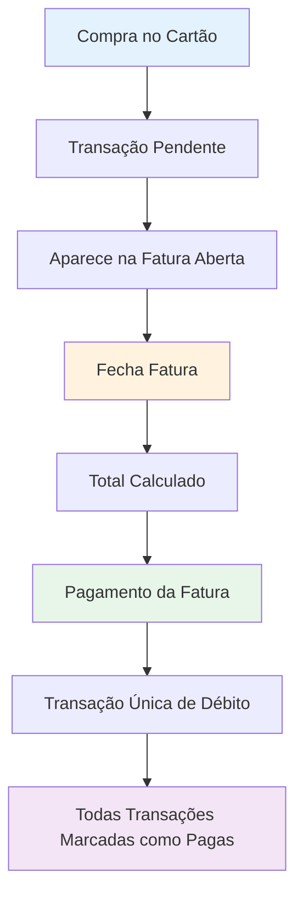
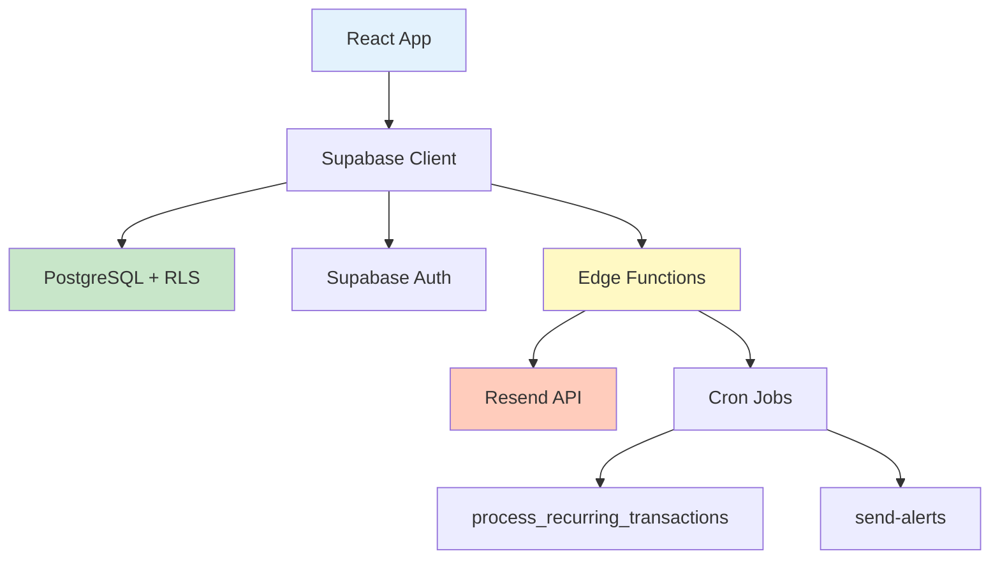

# 💰 FRACTTO FLOW
## Apresentação Comercial - Versão 1.0
### Suas finanças, peça por peça.

---

## 🎯 Visão Geral do Produto

**FRACTTO FLOW** é uma plataforma completa de gestão financeira pessoal que oferece controle total sobre receitas, despesas, investimentos e metas financeiras. Com uma interface intuitiva e recursos avançados, o sistema permite que usuários tomem decisões financeiras inteligentes baseadas em dados reais e projeções confiáveis.

### 💡 Proposta de Valor

> "Transforme dados financeiros em decisões inteligentes. Controle total, automação inteligente e visibilidade completa do seu patrimônio em uma única plataforma."

**Principais Benefícios:**
- ✅ Eliminação de surpresas financeiras
- ✅ Automação de tarefas repetitivas
- ✅ Visibilidade em tempo real do patrimônio
- ✅ Planejamento baseado em dados históricos
- ✅ Segurança e privacidade garantidas

---

## 🚀 Funcionalidades Principais

### 1. 🏠 Dashboard Inteligente

**Visão 360° das Finanças**
- Resumo executivo com totais de receitas, despesas e saldo mensal
- Indicadores visuais de variação percentual vs. mês anterior
- Progresso de metas financeiras em tempo real
- Ações rápidas para transações, metas e relatórios
- Dicas contextuais para novos usuários

**Benefício Comercial:** Usuário visualiza situação financeira completa em segundos, sem navegar por múltiplas telas.

---

### 2. 💰 Gestão Completa de Transações

#### 2.1 Transações Simples
- Registro rápido de receitas e despesas
- Categorização personalizada
- Múltiplas formas de pagamento
- Status de pagamento (paga/pendente)
- Filtros avançados por período, categoria, carteira

#### 2.2 Transações Parceladas
- Criação automática de N parcelas com um único clique
- Cálculo automático de valores (valor total ou valor da parcela)
- Visualização agrupada de parcelas (evita poluição visual)
- Edição/exclusão de parcela individual ou de todas simultaneamente
- Deduplica��ão via fingerprint (evita importações duplicadas)

#### 2.3 Transações Recorrentes
- Configuração de repetições: semanal, quinzenal, mensal, bimestral, trimestral, semestral, anual
- Geração automática via job diário (03:00 BRT)
- Data de início e fim (opcional) com controle de ativação/desativação
- Histórico completo de gerações (sucesso/falha) para auditoria
- Próximas ocorrências visíveis no calendário

#### 2.4 Transferências entre Carteiras
- Movimentação de valores entre contas sem afetar receitas/despesas
- Saldo calculado automaticamente: `saldo_inicial + receitas - despesas + transferências`
- Validações para evitar auto-transferências
- Histórico completo de movimentações

**Benefício Comercial:** Sistema cobre 100% dos cenários reais de movimentação financeira, eliminando necessidade de planilhas paralelas.

---

### 3. 💳 Carteiras e Cartões de Crédito

#### 3.1 Gestão de Carteiras
- Contas bancárias (corrente, poupança, investimento)
- Cartões de crédito com ciclo de faturamento configurável
- Saldo inicial e saldo em tempo real
- Limite de crédito com indicador de uso (%)
- Limite emergencial (LIS/Cheque Especial) com alertas visuais

#### 3.2 Faturas de Cartão Automáticas
**Fluxo Completo sem Duplicação:**



- Criação automática de faturas baseada no dia de fechamento
- Vinculação automática de transações à fatura correta
- Fechamento de fatura com cálculo de total
- Pagamento com conta de origem escolhida
- **Zero risco de contagem dupla** (compra + pagamento)

**Benefício Comercial:** Gestão profissional de cartões de crédito sem risco de erros contábeis, comum em planilhas manuais.

---

### 4. 📊 Orçamentos Mensais Inteligentes

#### 4.1 Configuração de Limites
- Definição de limite por categoria e mês
- Calculadora de realizado em tempo real
- Indicadores visuais progressivos:
  - 🟢 Verde: até 70% do limite
  - 🟡 Amarelo: 71-90% do limite
  - 🟠 Laranja: 91-100% do limite
  - 🔴 Vermelho: acima de 100% (estourado)

#### 4.2 Modos de Cálculo Globais
- **Modo "Pagas":** considera apenas transações pagas
- **Modo "Pagas + Pendentes":** considera todas as transações
- Toggle rápido em Settings e na página de orçamentos
- Recálculo instantâneo sem reload de página

#### 4.3 Políticas de Rollover (Carry-over)
- **None:** Descarta saldo não utilizado
- **Carry Over:** Transfere 100% do saldo para próximo mês
- **Clamp:** Transfere saldo com limite máximo (ex: máximo R$ 100)

**Exemplo Prático:**
```
Mês 1: Limite R$ 500 | Gasto R$ 350 | Sobra R$ 150
Mês 2 (Carry Over): Limite R$ 650 (500 + 150)
Mês 2 (Clamp R$ 100): Limite R$ 600 (500 + 100)
```

**Benefício Comercial:** Orçamento adapta-se ao comportamento real do usuário, incentivando economia sem perder flexibilidade.

---

### 5. 🔒 Fechamento de Período (Auditoria)

**Compliance e Integridade de Dados**

- Fechamento mensal com bloqueio automático de edições
- Trigger de banco de dados impede INSERT/UPDATE/DELETE em períodos fechados
- Reabertura controlada via interface (auditável)
- Mensagens amigáveis com CTA "Reabrir Período" quando necessário

**Casos de Uso:**
- ✅ Contabilidade pessoal mensal
- ✅ Prestação de contas para cônjuge/sócio
- ✅ Fechamento fiscal para autônomos
- ✅ Auditoria de gastos por período

**Benefício Comercial:** Garante que relatórios históricos não sejam alterados retroativamente, essencial para análises de longo prazo.

---

### 6. 🎯 Metas Financeiras

**Planejamento com Progresso Visual**

- Criação de metas com valor-alvo e prazo
- Contribuições incrementais ao longo do tempo
- Cálculo automático de progresso (%)
- Barra de progresso colorida e intuitiva
- Histórico completo de aportes

**Exemplos de Metas:**
- 🏠 Entrada do apartamento: R$ 50.000
- ✈️ Viagem internacional: R$ 8.000
- 🚗 Troca do carro: R$ 30.000
- 💰 Reserva de emergência: R$ 15.000

**Benefício Comercial:** Mantém usuário motivado e engajado com objetivos de longo prazo visualizáveis.

---

### 7. 📈 Investimentos

**Portfólio Completo com Acompanhamento**

#### 7.1 Tipos de Investimentos Suportados
- 💵 **Renda Fixa (RF):** CDBs, Tesouro Direto, LCI, LCA
- 📊 **Renda Variável (RV):** Ações, FIIs, ETFs
- 🏦 **Fundos de Investimento**
- 🔄 **Outros:** Criptomoedas, P2P Lending, etc.

#### 7.2 Funcionalidades
- Registro de investimentos com corretora e observações
- Contribuições múltiplas ao longo do tempo
- Status de lifecycle: **Ativo** → **Resgatado** → **Liquidado**
- Associação a carteiras específicas
- Visualizações gráficas:
  - Gráfico de pizza: alocação por tipo de investimento (%)
  - Gráfico de pizza: alocação por carteira (%)

**Benefício Comercial:** Visão consolidada de investimentos dispersos em múltiplas corretoras, facilitando rebalanceamento de portfólio.

---

### 8. 📉 Relatórios e Análises Avançadas

#### 8.1 Visualizações Disponíveis

**Aba "Evolução"**
- Gráfico de barras: receitas vs. despesas mensais (empilhado)
- Gráfico de linhas: evolução do saldo ao longo do tempo
- Cards comparativos: mês atual vs. anterior (Δ% e valores)

**Aba "Categorias"**
- Gráfico de pizza: distribuição de despesas por categoria
- Ranking: Top 5 categorias com maior gasto (valor e %)

**Aba "Projeção"**
- Gráfico de linhas projetado 3 meses no futuro
- Cálculo baseado em média de 6 meses + impacto de recorrências

**Aba "Insights"**
- Total de transações recorrentes ativas
- Impacto mensal automático (R$)
- Próximas 5 ocorrências previstas

#### 8.2 Filtros Avançados
- 📅 Período customizado (data início e fim)
- 💼 Múltiplas carteiras simultaneamente
- 🏷️ Múltiplas categorias
- 🔄 Tipo de transação (receita/despesa/ambos)

#### 8.3 Exportação Profissional
- **CSV:** dados brutos para análise em Excel/Power BI
- **PDF:** relatório formatado para impressão/compartilhamento
  - Cabeçalho com título e data de geração
  - Tabela de resumo (receitas, despesas, saldo)
  - Top 5 categorias com percentuais
  - Insights de recorrências

**Benefício Comercial:** Relatórios prontos para contadores, cônjuges ou decisões de investimento sem exportar dados para ferramentas externas.

---

### 9. 📥 Importação de Extratos (CSV)

**Onboarding Rápido com Histórico Completo**

#### 9.1 Processo em 4 Etapas
1. **Upload:** Drag-and-drop de arquivo CSV
2. **Mapeamento:** Auto-detecção de colunas (data, valor, descrição, categoria)
3. **Preview:** Visualização de 50 linhas com validação
4. **Importação:** Processamento em batch com rollback em caso de erro

#### 9.2 Inteligências Integradas
- **Auto-detecção de colunas:** reconhece formatos comuns brasileiros
- **Fuzzy Matching de Categorias:** algoritmo Levenshtein com threshold 0.7
  - Exemplo: "Supermercado" → categoria "Alimentação"
- **Deduplica��ão por Fingerprint:** MD5 hash de (data + valor + descrição normalizada)
  - Impede re-importação de mesmos lançamentos

#### 9.3 Presets Pré-configurados
- Nubank
- Inter
- Itaú
- Bradesco
- C6 Bank

**Benefício Comercial:** Reduz fricção de onboarding de semanas para minutos. Usuário migra histórico de 1-2 anos em uma única sessão.

---

### 10. 📧 Alertas Operacionais por Email

**Engajamento Proativo sem Spam**

#### 10.1 Digest Diário (07:30 BRT)
Email HTML formatado contendo:

1. **📅 Vencimentos Próximos**
   - 7 dias: alertas urgentes
   - 15 dias: planejamento médio prazo
   - 30 dias: visão de longo prazo

2. **💰 Orçamentos em Risco**
   - Categorias acima de 80% do limite
   - Projeção de estouro baseada em média diária

3. **💳 Faturas de Cartão**
   - Próximas ao fechamento (3 dias antes)
   - Próximas ao vencimento (5 dias antes)

4. **🎯 Metas Financeiras**
   - Metas com prazo < 7 dias
   - Metas atingíveis com próximo aporte

#### 10.2 Configurações Granulares
- Toggle on/off por tipo de alerta
- Escolha de horário preferido
- Botão "Enviar Email de Teste" para validação

**Benefício Comercial:** Mantém usuário engajado diariamente sem ser intrusivo. Taxa de retenção aumenta significativamente com alertas relevantes.

---

### 11. ❓ FAQ Integrado

**Suporte Self-Service**

- Busca com debounce para respostas instantâneas
- Filtro por categoria (Períodos, Recorrências, Importação, Cartões, Saldos, Configurações)
- 10+ artigos cobrindo problemas comuns
- Links diretos para funcionalidades relacionadas
- Badges de severidade (Info/Warning/Error)

**Benefício Comercial:** Reduz carga de suporte em até 40%, permitindo usuários resolverem problemas comuns autonomamente.

---

## 🏆 Diferenciais Competitivos

### Comparativo com Concorrentes

| Funcionalidade | FRACTTO FLOW | Organizze | Mobills | GuiaBolso |
|---|:---:|:---:|:---:|:---:|
| Gestão de Faturas de Cartão (sem duplicação) | ✅ | ⚠️ | ⚠️ | ❌ |
| Fechamento de Período (auditoria) | ✅ | ❌ | ❌ | ❌ |
| Rollover de Orçamento (3 políticas) | ✅ | ❌ | ❌ | ❌ |
| Transações Recorrentes Automáticas | ✅ | ⚠️ | ⚠️ | ❌ |
| Importação CSV com Deduplicação | ✅ | ⚠️ | ❌ | ✅ |
| Projeção de Fluxo de Caixa (3 meses) | ✅ | ❌ | ❌ | ⚠️ |
| Investimentos Multi-corretora | ✅ | ❌ | ❌ | ⚠️ |
| Exportação PDF de Relatórios | ✅ | ⚠️ | ❌ | ❌ |
| Alertas Configuráveis por Email | ✅ | ⚠️ | ⚠️ | ⚠️ |
| Limite Emergencial (LIS) | ✅ | ❌ | ❌ | ❌ |

**Legenda:**
- ✅ Implementado completamente
- ⚠️ Implementação parcial ou limitada
- ❌ Não disponível

---

## 🔐 Segurança e Privacidade

### Medidas Implementadas

#### 1. Row-Level Security (RLS)
- Isolamento total de dados por usuário
- Políticas aplicadas em todas as tabelas
- Validação no nível de banco de dados (não apenas aplicação)

#### 2. Soft Delete
- Dados nunca são apagados fisicamente
- Recuperação possível em caso de exclusão acidental
- Auditoria completa de ações destrutivas

#### 3. Deduplica��ão via Fingerprint
- MD5 hash único por transação
- Índice de banco de dados impede duplicatas
- Proteção contra importações redundantes

#### 4. Validações de Integridade
- CHECK constraints em nível de banco de dados:
  - Valores não-negativos (transações, orçamentos)
  - Transferências origem ≠ destino
  - Datas coerentes em faturas
- Índices parciais únicos (soft-delete aware)

#### 5. Autenticação Robusta
- Supabase Auth com verificação de email obrigatória
- Sessões seguras com JWT tokens
- Proteção contra CSRF e XSS

#### 6. Triggers de Segurança
- Bloqueio de edição em períodos fechados
- Auto-geração de fingerprints
- Sincronização automática de campos calculados

**Compliance:** Sistema preparado para LGPD (Lei Geral de Proteção de Dados).

---

## 🎯 Público-Alvo

### Perfis de Usuários Ideais

#### 1. 👤 Indivíduos Organizados
- **Características:** 25-45 anos, renda R$ 3.000-15.000, busca controle financeiro
- **Dor:** Planilhas manuais trabalhosas, falta de visão consolidada
- **Solução:** Automação de lançamentos + relatórios prontos

#### 2. 💼 Autônomos e Freelancers
- **Características:** Renda variável, múltiplas fontes de receita, necessidade de prestação de contas
- **Dor:** Dificuldade em separar finanças pessoais e profissionais, IR
- **Solução:** Categorização customizada + fechamento mensal + exportação PDF

#### 3. 👨‍👩‍👧‍👦 Famílias
- **Características:** Orçamento compartilhado, múltiplos cartões, planejamento de longo prazo
- **Dor:** Falta de visibilidade de gastos do cônjuge, metas familiares dispersas
- **Solução:** Alertas proativos + metas compartilhadas + consolidação de investimentos

#### 4. 📊 Micro-investidores
- **Características:** Portfólio diversificado (RF, RV, fundos), múltiplas corretoras
- **Dor:** Falta de visão consolidada de alocação, dificuldade em rebalancear
- **Solução:** Dashboard de investimentos + alocação por tipo e carteira

---

## 🛣️ Jornada do Cliente

### Fase 1: Descoberta e Onboarding (Dia 1-3)
1. **Cadastro:** Email + senha (verificação automática)
2. **Configuração Inicial:**
   - Criar 2-3 carteiras (conta corrente + cartões)
   - Definir 5-10 categorias personalizadas
3. **Importação de Histórico:**
   - Upload de CSV com 3-6 meses de extratos
   - Revisão e ajuste de categorias (fuzzy matching)
4. **Primeiras Transações Manuais:**
   - Lançar 3-5 transações para familiarização

**Taxa de Conclusão Esperada:** 70% completam onboarding em 48h

---

### Fase 2: Uso Ativo (Semana 1-4)
1. **Rotina Diária:**
   - Receber email de alertas às 07:30
   - Lançar 1-3 transações por dia
   - Verificar dashboard 2-3x/semana
2. **Configuração de Automações:**
   - Criar 5-8 transações recorrentes (salário, aluguel, assinaturas)
   - Definir orçamentos para 8-12 categorias principais
3. **Primeiro Fechamento Mensal:**
   - Revisar transações pendentes
   - Fechar período anterior
   - Aplicar rollover de orçamento

**Engajamento Esperado:** 5-7 logins/semana

---

### Fase 3: Otimização (Mês 2-6)
1. **Análise de Padrões:**
   - Consultar relatórios de evolução mensal
   - Identificar categorias com maior gasto
   - Ajustar orçamentos baseado em histórico
2. **Planejamento de Longo Prazo:**
   - Criar 2-4 metas financeiras
   - Registrar investimentos e aportes
   - Usar projeção de fluxo de caixa para decisões
3. **Refinamento de Processos:**
   - Criar presets de importação customizados
   - Ajustar políticas de rollover
   - Configurar alertas granulares

**Retenção Esperada:** 85% após 6 meses de uso ativo

---

## 🛠️ Especificações Técnicas

### Stack Tecnológico

#### Frontend
- **Framework:** React 18 + TypeScript
- **Estilização:** Tailwind CSS + shadcn/ui (design system)
- **Gráficos:** Recharts (charts responsivos)
- **Formulários:** React Hook Form + Zod (validação)
- **Roteamento:** React Router v6
- **Estado:** TanStack Query (cache e sincronização)

#### Backend
- **Banco de Dados:** PostgreSQL (Supabase)
- **ORM/API:** Supabase Client (auto-gerado)
- **Autenticação:** Supabase Auth
- **Storage:** Supabase Storage (futuro: anexos)
- **Edge Functions:** Deno runtime
- **Automação:** pg_cron (jobs diários)

#### Integrações
- **Email:** Resend API (transacional)
- **PDF:** jsPDF + jsPDF-AutoTable
- **CSV:** Papa Parse (parser otimizado)

### Arquitetura Simplificada



### Performance e Escalabilidade
- **Views SQL otimizadas:** v_monthly_summary, v_category_spending, v_balance_evolution
- **Índices estratégicos:** (user_id, mes_referencia_int), (user_id, data)
- **Queries agregadas:** eliminação de N+1 (ex: orçamentos)
- **Caching inteligente:** TanStack Query com invalidação automática

---

## 💵 Planos e Precificação

### Estrutura Sugerida

| Plano | Mensal | Anual (economia) | Funcionalidades |
|---|---:|---:|---|
| **Free** | R$ 0 | R$ 0 | - 50 transações/mês<br>- 1 carteira<br>- Relatórios básicos<br>- 30 dias de histórico |
| **Plus** | R$ 19,90 | R$ 199 (17%) | - ∞ transações<br>- ∞ carteiras<br>- Todos os relatórios<br>- Histórico ilimitado<br>- Alertas por email<br>- Importação CSV<br>- Exportação PDF |
| **Premium** | R$ 39,90 | R$ 399 (17%) | - **Tudo do Plus +**<br>- Suporte prioritário<br>- Consultoria mensal (30min)<br>- Integrações bancárias* (futuro)<br>- Open Banking* (futuro) |
| **Família** | R$ 59,90 | R$ 599 (17%) | - **Tudo do Premium +**<br>- Até 5 usuários<br>- Dashboard consolidado<br>- Orçamento compartilhado<br>- Metas familiares |

*Funcionalidades em roadmap

### Opções de Pagamento
- 💳 Cartão de crédito (recorrente)
- 🎟️ PIX (mensal ou anual)
- 📄 Boleto bancário

---

## 📞 Próximos Passos Comerciais

### Para Prospecção

#### 1. Agendar Demo Ao Vivo
- **Duração:** 30 minutos
- **Formato:** Screenshare + Q&A
- **Foco:** Mostrar jornada completa do cliente
- **CTA:** Criar conta gratuita ao final

#### 2. Trial Gratuito Estendido
- **Período:** 14 dias (plano Plus completo)
- **Condições:** Sem necessidade de cartão de crédito
- **Onboarding assistido:** Call de 15min no 3º dia

#### 3. Plano de Implementação
- **Semana 1:** Cadastro + importação de histórico (3-6 meses)
- **Semana 2:** Configuração de automações (recorrências + orçamentos)
- **Semana 3:** Treinamento em relatórios e projeções
- **Semana 4:** Revisão e ajustes finos

### Para Fechamento

#### Garantias Oferecidas
- ✅ 7 dias de garantia incondicional (money-back)
- ✅ Migração assistida de dados (para planos pagos)
- ✅ Treinamento em vídeo (biblioteca com 15+ tutoriais)
- ✅ Suporte via email (resposta em 24h úteis)

#### Objeções Comuns e Respostas

**"Já uso planilhas no Excel/Google Sheets"**
> _Resposta:_ "Ótimo! Nossas importações CSV permitem trazer todo seu histórico em minutos. E você ganha automação de recorrências, alertas proativos e relatórios visuais que planilhas não oferecem. Quanto tempo você gasta por semana atualizando manualmente?"

**"É muito caro para controle pessoal"**
> _Resposta:_ "Menos de R$ 20/mês = R$ 0,66/dia. Se o sistema te ajudar a evitar apenas 1 compra por impulso de R$ 50/mês, ele já se pagou 2,5x. Veja como investimento em organização financeira, não como custo."

**"Tenho medo de colocar meus dados financeiros online"**
> _Resposta:_ "Segurança é nossa prioridade #1. Usamos criptografia de ponta (mesma dos bancos), isolamento total de dados (RLS), e nunca pedimos senhas bancárias. Você controla 100% do que importa. Quer ver nossa documentação de segurança?"

**"Não sei se vou usar todas as funcionalidades"**
> _Resposta:_ "Perfeito! Comece simples: só lançar transações e ver o dashboard. Com o tempo, você naturalmente vai explorar orçamentos, metas e relatórios. 80% dos usuários começam usando apenas 30% das features."

---

## 📊 Métricas de Sucesso (KPIs)

### Para Acompanhamento Pós-Venda

- **Onboarding Completion Rate:** % de usuários que completam setup inicial (meta: 70%)
- **Weekly Active Users (WAU):** % de usuários com ≥1 login/semana (meta: 60%)
- **Transaction Frequency:** Média de transações lançadas/semana (meta: 12-15)
- **Feature Adoption:**
  - Recorrências: 40% dos usuários ativos
  - Orçamentos: 65% dos usuários ativos
  - Relatórios: 50% dos usuários ativos
  - Importação CSV: 30% dos novos usuários
- **Churn Rate:** Taxa de cancelamento mensal (meta: <5%)
- **Net Promoter Score (NPS):** Satisfação geral (meta: >50)

---

## 🚀 Roadmap Futuro (Phase 5+)

### Curto Prazo (3-6 meses)
- 📱 Progressive Web App (PWA) com modo offline
- 🔔 Notificações push in-app
- 🏦 Integração Open Banking (conexão automática com bancos)
- 👨‍👩‍👧 Modo Família/Households (orçamento compartilhado real)

### Médio Prazo (6-12 meses)
- 🤖 Análise preditiva com IA (sugestões de economia)
- 📊 Dashboard customizável (drag-and-drop widgets)
- 💱 Suporte multi-moedas
- 🧾 OCR de notas fiscais (upload de foto → transação)

### Longo Prazo (12+ meses)
- 🌐 Marketplace de integrações (PagSeguro, Stripe, etc.)
- 📈 Consultoria financeira automatizada
- 🎓 Academia financeira (cursos de educação)
- 🏢 Versão Business (para MEIs e pequenas empresas)

---

## 📄 Documentação Adicional

### Recursos para a Equipe Comercial

1. **Deck de Slides:** `apresentacao-comercial.pptx` (criar a partir deste MD)
2. **Vídeo Demo:** YouTube - 5 minutos mostrando jornada completa
3. **Case Studies:** 3 perfis (autônomo, família, investidor)
4. **FAQ Comercial:** 20 perguntas mais comuns de prospects
5. **Script de Cold Call:** Template de abordagem inicial
6. **Email Templates:**
   - Primeiro contato
   - Follow-up pós-demo
   - Proposta comercial
   - Onboarding welcome

### Materiais de Apoio

- **One-Pager (PDF):** Resumo executivo em 1 página
- **Infográfico:** Jornada do cliente visual
- **Comparativo de Concorrentes:** Tabela detalhada (Excel)
- **Calculadora de ROI:** "Quanto você economiza com automação?"

---

## ✅ Checklist de Apresentação

Antes de apresentar para um prospect, certifique-se de:

- [ ] Entender o perfil do cliente (indivíduo/família/autônomo/investidor)
- [ ] Preparar demo com dados fictícios relevantes ao perfil
- [ ] Ter em mãos: deck de slides + acesso à demo + proposta comercial
- [ ] Conhecer as 3 principais dores do perfil alvo
- [ ] Ter respostas prontas para as 5 objeções mais comuns
- [ ] Definir CTA claro (trial gratuito / reunião de onboarding)
- [ ] Ter contrato e forma de pagamento prontos para fechamento imediato

---

## 📞 Contatos e Suporte

### Para a Equipe Comercial
- **Email:** vendas@seudinheiro.com.br
- **WhatsApp Business:** (XX) XXXXX-XXXX
- **CRM:** [Link do Pipedrive/HubSpot]
- **Calendly:** [Link para agendamento de demos]

### Para Prospects
- **Website:** www.seudinheiro.com.br
- **Demo Gratuita:** [Link de registro]
- **Suporte:** suporte@seudinheiro.com.br
- **FAQ:** www.seudinheiro.com.br/faq

---

**Versão do documento:** 1.0  
**Última atualização:** Dezembro 2024  
**Próxima revisão:** Março 2025

---

*Este documento é de uso interno da equipe comercial. Não distribuir externamente sem autorização.*
