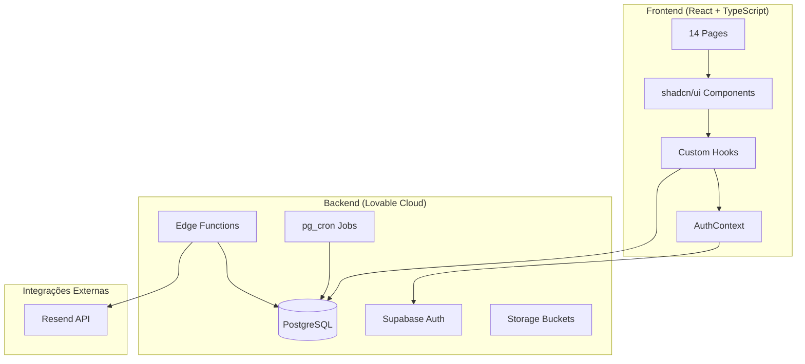
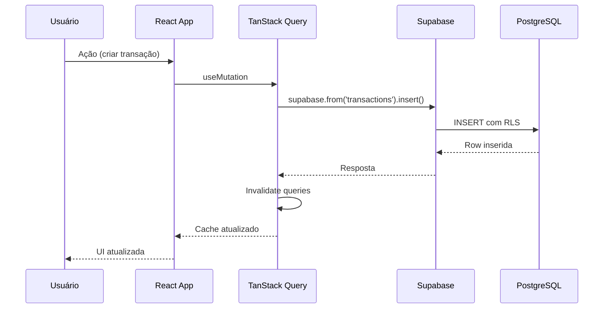
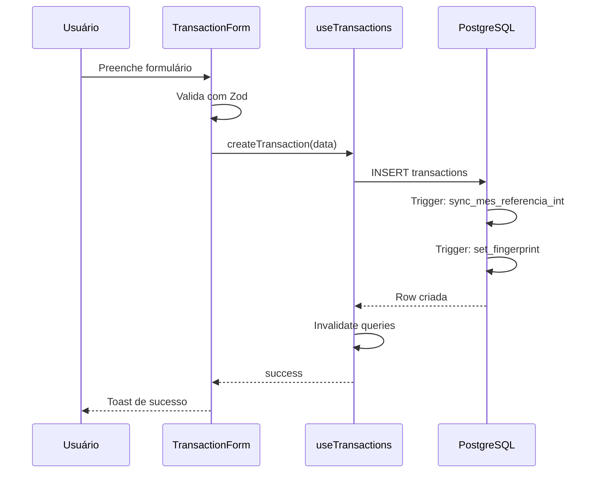
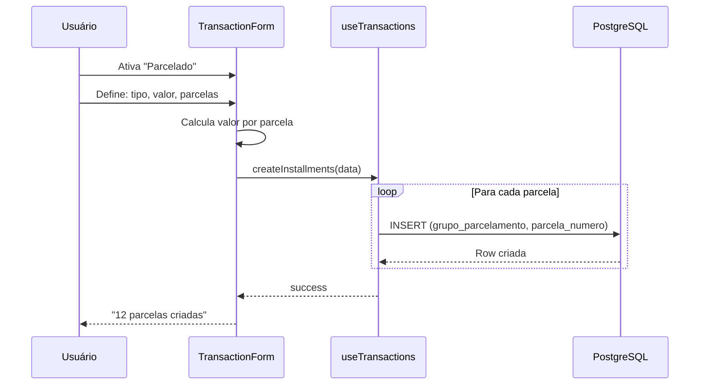
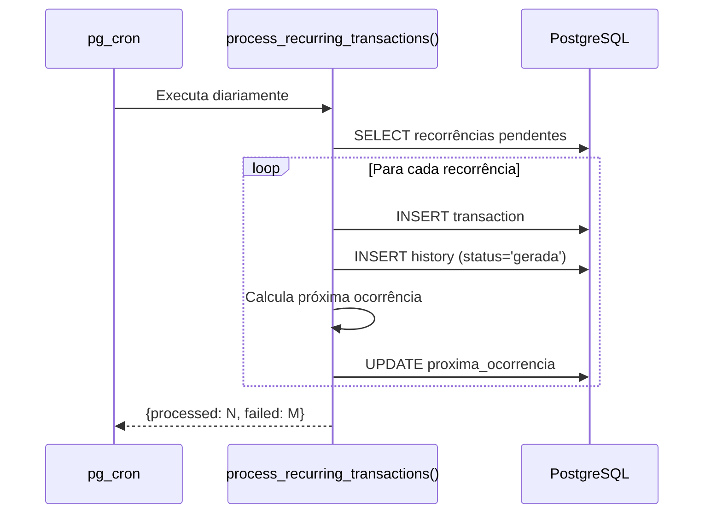
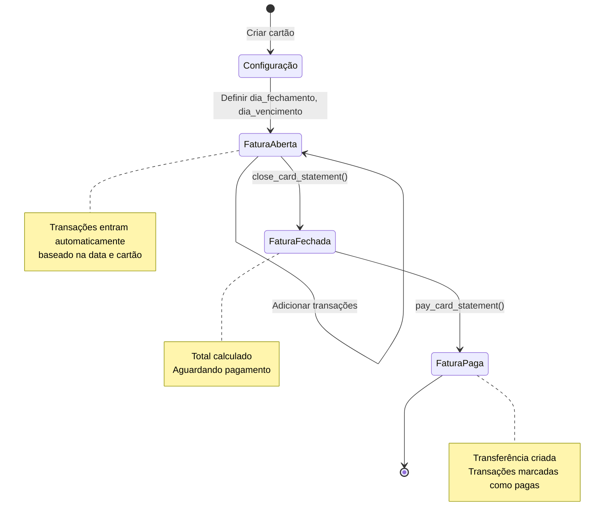
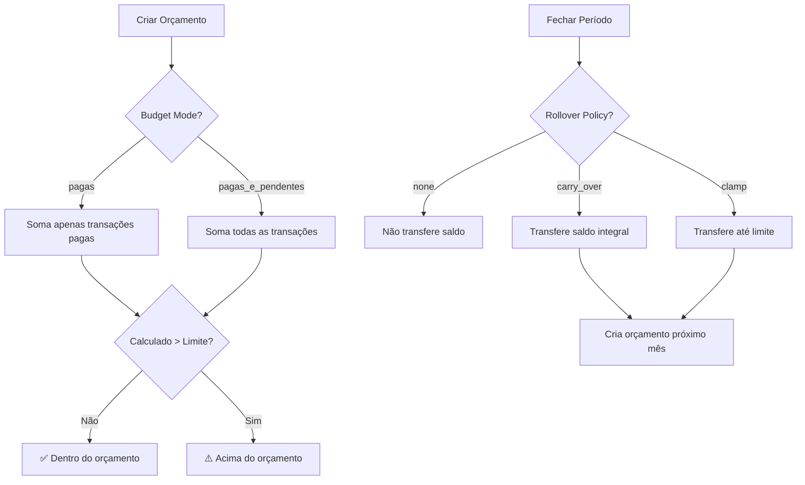
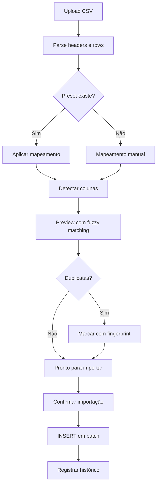

# 📊 FRACTTO FLOW - Documentação Técnica Completa


> **"Suas Finanças, Peça por Peça"** - Plataforma completa de gestão financeira pessoal

**URL Produção:** https://fracttoflow.lovable.app

---

## 📋 Sumário

1. [Visão Geral](#1-visão-geral)
2. [Stack Tecnológico](#2-stack-tecnológico)
3. [Arquitetura do Sistema](#3-arquitetura-do-sistema)
4. [Estrutura de Diretórios](#4-estrutura-de-diretórios)
5. [Schema do Banco de Dados](#5-schema-do-banco-de-dados)
6. [Edge Functions](#6-edge-functions)
7. [Hooks Customizados](#7-hooks-customizados)
8. [Fluxos de Negócio](#8-fluxos-de-negócio)
9. [Segurança](#9-segurança)
10. [Padrões de Desenvolvimento](#10-padrões-de-desenvolvimento)
11. [Configurações](#11-configurações)
12. [Troubleshooting](#12-troubleshooting)
13. [Documentos de Apoio](#13-documentos-de-apoio)

---

## 1. Visão Geral

### 1.1 Propósito

FRACTTO FLOW é uma plataforma SaaS de gestão financeira pessoal que permite aos usuários:

- Controlar receitas e despesas (simples, parceladas e recorrentes)
- Gerenciar carteiras (contas bancárias e cartões de crédito)
- Acompanhar faturas de cartão com ciclo automático
- Definir orçamentos mensais por categoria com políticas de rollover
- Estabelecer metas financeiras com contribuições
- Gerenciar investimentos (RF, RV, Fundos)
- Importar extratos bancários via CSV
- Gerar relatórios e exportar para PDF/CSV
- Receber alertas por email sobre vencimentos e orçamentos

### 1.2 Características Principais

| Feature | Descrição |
|---------|-----------|
| Multi-tenant | Cada usuário vê apenas seus dados (RLS) |
| Offline-ready | TanStack Query com cache persistente |
| Responsivo | Mobile-first design |
| Timezone-aware | Fixo em America/Sao_Paulo |
| Período fechado | Bloqueia edições retroativas |

---

## 2. Stack Tecnológico

### 2.1 Frontend

```yaml
Framework: React 18.3.1
Linguagem: TypeScript 5.x
Build Tool: Vite 5.x
Estilização:
  - Tailwind CSS 3.x
  - shadcn/ui (50+ componentes)
  - Lucide React (ícones)
Estado:
  - TanStack Query 5.x (server state)
  - React Context (auth state)
Roteamento: React Router DOM 6.30.1
Formulários:
  - React Hook Form 7.x
  - Zod 3.x (validação)
  - @hookform/resolvers
Gráficos: Recharts 2.15.4
PDF: jsPDF + jspdf-autotable
Datas: date-fns 4.1.0
Notificações: Sonner 1.7.x
```

### 2.2 Backend (Lovable Cloud)

```yaml
Banco de Dados: PostgreSQL 15+
Autenticação: Supabase Auth
API: PostgREST (auto-generated)
Edge Functions: Deno Runtime
Storage: Supabase Storage
Automação: pg_cron
Email: Resend API
```

### 2.3 Dependências Principais

```json
{
  "@supabase/supabase-js": "^2.76.1",
  "@tanstack/react-query": "^5.83.0",
  "date-fns": "^4.1.0",
  "react-hook-form": "^7.61.1",
  "recharts": "^2.15.4",
  "zod": "^3.25.76",
  "jspdf": "^2.5.2",
  "lucide-react": "^0.462.0"
}
```

---

## 3. Arquitetura do Sistema

### 3.1 Diagrama de Arquitetura



### 3.2 Fluxo de Dados



---

## 4. Estrutura de Diretórios

```
fractto-flow/
├── .lovable/
│   └── plan.md                  # Plano de implementação
├── public/
│   ├── favicon.ico
│   ├── favicon.svg
│   ├── placeholder.svg
│   └── robots.txt
├── src/
│   ├── App.tsx                  # Roteamento principal
│   ├── App.css                  # Estilos da aplicação
│   ├── main.tsx                 # Entry point
│   ├── index.css                # Estilos globais + Design tokens
│   ├── vite-env.d.ts            # Tipos Vite
│   │
│   ├── assets/
│   │   └── logo-fractto.png     # Logo da aplicação
│   │
│   ├── components/
│   │   ├── ui/                  # shadcn/ui (50+ componentes)
│   │   │   ├── accordion.tsx
│   │   │   ├── alert.tsx
│   │   │   ├── avatar.tsx
│   │   │   ├── badge.tsx
│   │   │   ├── button.tsx
│   │   │   ├── calendar.tsx
│   │   │   ├── card.tsx
│   │   │   ├── chart.tsx
│   │   │   ├── checkbox.tsx
│   │   │   ├── dialog.tsx
│   │   │   ├── dropdown-menu.tsx
│   │   │   ├── form.tsx
│   │   │   ├── input.tsx
│   │   │   ├── label.tsx
│   │   │   ├── popover.tsx
│   │   │   ├── progress.tsx
│   │   │   ├── select.tsx
│   │   │   ├── separator.tsx
│   │   │   ├── sheet.tsx
│   │   │   ├── sidebar.tsx
│   │   │   ├── skeleton.tsx
│   │   │   ├── sonner.tsx
│   │   │   ├── switch.tsx
│   │   │   ├── table.tsx
│   │   │   ├── tabs.tsx
│   │   │   ├── textarea.tsx
│   │   │   ├── toast.tsx
│   │   │   ├── toaster.tsx
│   │   │   ├── tooltip.tsx
│   │   │   └── ...
│   │   │
│   │   ├── budget/
│   │   │   ├── BudgetCard.tsx       # Card de orçamento individual
│   │   │   └── BudgetForm.tsx       # Formulário de orçamento
│   │   │
│   │   ├── calendar/
│   │   │   ├── CalendarDay.tsx      # Dia do calendário
│   │   │   ├── CalendarGrid.tsx     # Grid mensal
│   │   │   └── DayDetailsDialog.tsx # Detalhes do dia
│   │   │
│   │   ├── dashboard/
│   │   │   └── StatCard.tsx         # Card de estatísticas
│   │   │
│   │   ├── faq/
│   │   │   ├── FAQCategoryFilter.tsx
│   │   │   ├── FAQEmptyState.tsx
│   │   │   ├── FAQItem.tsx
│   │   │   └── FAQSearch.tsx
│   │   │
│   │   ├── forms/
│   │   │   ├── CurrencyInput.tsx    # Input de moeda formatado
│   │   │   └── PaymentMethodSelect.tsx
│   │   │
│   │   ├── goals/
│   │   │   ├── ContributionForm.tsx # Form de contribuição
│   │   │   ├── GoalCard.tsx         # Card de meta
│   │   │   └── GoalForm.tsx         # Form de meta
│   │   │
│   │   ├── import/
│   │   │   ├── CSVUploader.tsx      # Upload de arquivo
│   │   │   ├── ColumnMapper.tsx     # Mapeamento de colunas
│   │   │   ├── ImportPreview.tsx    # Preview dos dados
│   │   │   └── ImportSummary.tsx    # Resumo da importação
│   │   │
│   │   ├── investments/
│   │   │   ├── InvestmentCard.tsx
│   │   │   ├── InvestmentContributionForm.tsx
│   │   │   └── InvestmentForm.tsx
│   │   │
│   │   ├── landing/
│   │   │   ├── ContactSection.tsx   # Formulário de contato
│   │   │   ├── FAQSection.tsx       # FAQ da landing
│   │   │   ├── FeaturesSection.tsx  # Features
│   │   │   ├── Footer.tsx           # Rodapé
│   │   │   ├── HeroSection.tsx      # Hero
│   │   │   ├── Navbar.tsx           # Navegação
│   │   │   ├── PricingSection.tsx   # Preços
│   │   │   └── TestimonialsSection.tsx
│   │   │
│   │   ├── layout/
│   │   │   └── AppLayout.tsx        # Layout principal com sidebar
│   │   │
│   │   ├── periods/
│   │   │   └── QuickPeriodActions.tsx # Ações de período
│   │   │
│   │   ├── recurring/
│   │   │   ├── RecurringTransactionCard.tsx
│   │   │   ├── RecurringTransactionForm.tsx
│   │   │   ├── RecurringTransactionHistory.tsx
│   │   │   └── RecurringTransactionsList.tsx
│   │   │
│   │   ├── reports/
│   │   │   ├── BalanceLineChart.tsx     # Evolução de saldo
│   │   │   ├── CategoryPieChart.tsx     # Pizza por categoria
│   │   │   ├── ComparisonCard.tsx       # Comparação mensal
│   │   │   ├── MonthlyBarChart.tsx      # Barras mensais
│   │   │   ├── RecurringInsightsCard.tsx
│   │   │   ├── ReportFilters.tsx        # Filtros
│   │   │   └── TopCategoriesCard.tsx    # Top categorias
│   │   │
│   │   ├── settings/
│   │   │   ├── AlertSettings.tsx        # Config de alertas
│   │   │   └── BudgetModeToggle.tsx     # Toggle modo orçamento
│   │   │
│   │   ├── statements/
│   │   │   ├── PayStatementDialog.tsx   # Dialog de pagamento
│   │   │   ├── StatementCard.tsx        # Card de fatura
│   │   │   ├── StatementDetails.tsx     # Detalhes da fatura
│   │   │   └── StatementsList.tsx       # Lista de faturas
│   │   │
│   │   ├── transactions/
│   │   │   ├── InstallmentGroupRow.tsx  # Row de parcelas
│   │   │   ├── TransactionFilters.tsx   # Filtros
│   │   │   └── TransactionForm.tsx      # Form completo
│   │   │
│   │   ├── transfers/
│   │   │   ├── TransferCard.tsx         # Card de transferência
│   │   │   └── TransferForm.tsx         # Form de transferência
│   │   │
│   │   ├── wallets/
│   │   │   ├── CreditLimitCard.tsx      # Card de limite
│   │   │   └── EmergencyLimitAlert.tsx  # Alerta de emergência
│   │   │
│   │   ├── ErrorBoundary.tsx            # Error boundary global
│   │   └── ProtectedRoute.tsx           # Rota protegida
│   │
│   ├── contexts/
│   │   └── AuthContext.tsx              # Context de autenticação
│   │
│   ├── data/
│   │   └── faqData.ts                   # Dados do FAQ
│   │
│   ├── hooks/
│   │   ├── use-mobile.tsx               # Hook de responsividade
│   │   ├── use-toast.ts                 # Hook de toast
│   │   ├── useAlertSettings.ts          # Configurações de alerta
│   │   ├── useAutoStatement.ts          # Fatura automática
│   │   ├── useBudgets.ts                # CRUD orçamentos
│   │   ├── useCalendar.ts               # Dados do calendário
│   │   ├── useCardLimits.ts             # Limites de cartão
│   │   ├── useCategories.ts             # CRUD categorias
│   │   ├── useGoals.ts                  # CRUD metas
│   │   ├── useImporter.ts               # Importação CSV
│   │   ├── useInvestments.ts            # CRUD investimentos
│   │   ├── useLeads.ts                  # Leads da landing
│   │   ├── usePaymentMethods.ts         # Formas de pagamento
│   │   ├── usePeriods.ts                # Controle de períodos
│   │   ├── useRecurringTransactions.ts  # Recorrências
│   │   ├── useReports.ts                # Dados de relatórios
│   │   ├── useStatements.ts             # Faturas de cartão
│   │   ├── useTransactions.ts           # CRUD transações
│   │   ├── useTransfers.ts              # CRUD transferências
│   │   ├── useUserSettings.ts           # Configurações usuário
│   │   └── useWallets.ts                # CRUD carteiras
│   │
│   ├── integrations/
│   │   └── supabase/
│   │       ├── client.ts                # Cliente Supabase
│   │       └── types.ts                 # Tipos auto-gerados
│   │
│   ├── lib/
│   │   ├── budget.ts                    # Utilitários de orçamento
│   │   ├── categoryMatcher.ts           # Fuzzy matching
│   │   ├── csvParser.ts                 # Parser CSV
│   │   ├── currency.ts                  # Formatação BRL
│   │   ├── date.ts                      # Utilitários de data
│   │   ├── deduplication.ts             # Fingerprint MD5
│   │   ├── export.ts                    # Exportação
│   │   ├── goals.ts                     # Utilitários de metas
│   │   ├── masks.ts                     # Máscaras de input
│   │   ├── pdfGenerator.ts              # Geração de PDF
│   │   ├── periodValidation.ts          # Validação de período
│   │   ├── statementCycle.ts            # Ciclo de fatura
│   │   ├── supabase.ts                  # Re-export do cliente
│   │   ├── utils.ts                     # Utilitários gerais (cn)
│   │   └── validations.ts               # Schemas Zod
│   │
│   ├── pages/
│   │   ├── Auth.tsx                     # Login/Signup
│   │   ├── Budget.tsx                   # Orçamentos
│   │   ├── Calendar.tsx                 # Calendário financeiro
│   │   ├── Categories.tsx               # Categorias
│   │   ├── Dashboard.tsx                # Dashboard principal
│   │   ├── FAQ.tsx                      # FAQ interno
│   │   ├── Goals.tsx                    # Metas
│   │   ├── Import.tsx                   # Importação CSV
│   │   ├── Index.tsx                    # Redirect
│   │   ├── Investments.tsx              # Investimentos
│   │   ├── Landing.tsx                  # Landing page
│   │   ├── NotFound.tsx                 # 404
│   │   ├── Reports.tsx                  # Relatórios
│   │   ├── Settings.tsx                 # Configurações
│   │   ├── Transactions.tsx             # Transações
│   │   ├── Transfers.tsx                # Transferências
│   │   └── Wallets.tsx                  # Carteiras
│   │
│   └── types/
│       └── faq.ts                       # Tipos do FAQ
│
├── supabase/
│   ├── config.toml                      # Configuração Edge Functions
│   └── functions/
│       ├── generate-social-image/
│       │   └── index.ts                 # Geração de OG image
│       └── send-alerts/
│           ├── emailTemplate.ts         # Template HTML do email
│           └── index.ts                 # Envio de alertas
│
├── .env                                 # Variáveis de ambiente
├── components.json                      # Config shadcn/ui
├── eslint.config.js                     # Config ESLint
├── index.html                           # HTML principal
├── postcss.config.js                    # Config PostCSS
├── tailwind.config.ts                   # Config Tailwind
├── tsconfig.json                        # Config TypeScript
├── tsconfig.app.json                    # Config TS app
├── tsconfig.node.json                   # Config TS node
├── vite.config.ts                       # Config Vite
│
├── README.md                            # Visão geral
├── OPERATIONS.md                        # Procedimentos operacionais
├── JORNADA_CLIENTE.md                   # Jornada do usuário
├── APRESENTACAO_COMERCIAL.md            # Apresentação comercial
└── DOCUMENTATION.md                     # Esta documentação
```

---

## 5. Schema do Banco de Dados

### 5.1 Diagrama ER Principal

```mermaid
erDiagram
    profiles ||--o{ transactions : "user_id"
    profiles ||--o{ categories : "user_id"
    profiles ||--o{ wallets : "user_id"
    profiles ||--o{ budgets : "user_id"
    profiles ||--o{ goals : "user_id"
    profiles ||--o{ investments : "user_id"
    profiles ||--o{ transfers : "user_id"
    profiles ||--o{ recurring_transactions : "user_id"
    profiles ||--o{ card_statements : "user_id"
    profiles ||--o{ periods : "user_id"
    profiles ||--o{ user_settings : "user_id"
    profiles ||--o{ alert_settings : "user_id"
    
    categories ||--o{ transactions : "category_id"
    categories ||--o{ budgets : "category_id"
    categories ||--o{ recurring_transactions : "category_id"
    
    wallets ||--o{ transactions : "wallet_id"
    wallets ||--o{ transfers : "from_wallet_id"
    wallets ||--o{ transfers : "to_wallet_id"
    wallets ||--o{ card_statements : "wallet_id"
    wallets ||--o{ investments : "wallet_id"
    
    payment_methods ||--o{ transactions : "payment_method_id"
    payment_methods ||--o{ recurring_transactions : "payment_method_id"
    
    goals ||--o{ goals_contribs : "goal_id"
    investments ||--o{ investment_contribs : "investment_id"
    
    card_statements ||--o{ card_statement_lines : "statement_id"
    transactions ||--o{ card_statement_lines : "transaction_id"
    
    recurring_transactions ||--o{ recurring_transaction_history : "recurring_transaction_id"
    transactions ||--o{ recurring_transaction_history : "transaction_id"
    
    profiles {
        uuid id PK
        text full_name
        timestamp created_at
        timestamp updated_at
    }
    
    transactions {
        uuid id PK
        uuid user_id FK
        uuid category_id FK
        uuid wallet_id FK
        uuid payment_method_id FK
        enum tipo "receita|despesa"
        text descricao
        numeric valor
        date data
        text mes_referencia
        int mes_referencia_int
        enum status "paga|pendente"
        text forma_pagamento
        text natureza "fixa|variavel"
        uuid grupo_parcelamento
        int parcela_numero
        int parcela_total
        numeric valor_parcela
        numeric valor_total_parcelado
        text fingerprint
        timestamp deleted_at
    }
    
    categories {
        uuid id PK
        uuid user_id FK
        text nome
        enum tipo "despesa|receita|investimento|divida"
        timestamp deleted_at
    }
    
    wallets {
        uuid id PK
        uuid user_id FK
        text nome
        enum tipo "conta|cartao"
        text instituicao
        numeric saldo_inicial
        numeric limite_credito
        numeric limite_emergencia
        int dia_fechamento
        int dia_vencimento
        boolean ativo
        timestamp deleted_at
    }
    
    budgets {
        uuid id PK
        uuid user_id FK
        uuid category_id FK
        int ano
        int mes
        numeric limite_valor
        enum rollover_policy "none|carry_over|clamp"
        numeric rollover_cap
        timestamp deleted_at
    }
    
    goals {
        uuid id PK
        uuid user_id FK
        text nome
        numeric valor_meta
        date prazo
        timestamp deleted_at
    }
    
    goals_contribs {
        uuid id PK
        uuid goal_id FK
        numeric valor
        date data
    }
    
    investments {
        uuid id PK
        uuid user_id FK
        uuid wallet_id FK
        text nome
        text tipo "rf|rv|fundo|outros"
        text corretora
        text observacoes
        text status "ativo|resgatado|liquidado"
        timestamp deleted_at
    }
    
    investment_contribs {
        uuid id PK
        uuid investment_id FK
        numeric valor
        date data
    }
    
    transfers {
        uuid id PK
        uuid user_id FK
        uuid from_wallet_id FK
        uuid to_wallet_id FK
        numeric valor
        date data
        text descricao
        timestamp deleted_at
    }
    
    card_statements {
        uuid id PK
        uuid user_id FK
        uuid wallet_id FK
        date abre
        date fecha
        date vence
        numeric total
        enum status "aberta|fechada|paga"
    }
    
    card_statement_lines {
        uuid statement_id FK
        uuid transaction_id FK
    }
    
    recurring_transactions {
        uuid id PK
        uuid user_id FK
        uuid category_id FK
        uuid wallet_id FK
        uuid payment_method_id FK
        enum tipo "receita|despesa"
        text descricao
        numeric valor
        text natureza
        enum frequencia
        int dia_referencia
        date data_inicio
        date data_fim
        date proxima_ocorrencia
        date ultima_geracao
        boolean ativo
        timestamp deleted_at
    }
    
    periods {
        uuid id PK
        uuid user_id FK
        int year
        int month
        enum status "open|closed"
        timestamp closed_at
        uuid closed_by
    }
```



### 5.2 Tabelas Detalhadas

#### 5.2.1 profiles

Perfis de usuário, criado automaticamente via trigger no auth.users.

```sql
CREATE TABLE public.profiles (
    id UUID PRIMARY KEY REFERENCES auth.users(id) ON DELETE CASCADE,
    full_name TEXT,
    created_at TIMESTAMPTZ DEFAULT now(),
    updated_at TIMESTAMPTZ DEFAULT now()
);
```

**RLS Policies:**
- SELECT: `auth.uid() = id`
- UPDATE: `auth.uid() = id`

---

#### 5.2.2 transactions

Lançamentos financeiros (receitas e despesas).

```sql
CREATE TABLE public.transactions (
    id UUID PRIMARY KEY DEFAULT gen_random_uuid(),
    user_id UUID NOT NULL,
    category_id UUID NOT NULL REFERENCES categories(id),
    wallet_id UUID REFERENCES wallets(id),
    payment_method_id UUID REFERENCES payment_methods(id),
    tipo transaction_type NOT NULL, -- 'receita' | 'despesa'
    descricao TEXT NOT NULL,
    valor NUMERIC(14,2) NOT NULL,
    data DATE NOT NULL,
    mes_referencia TEXT NOT NULL, -- 'YYYY-MM'
    mes_referencia_int INTEGER, -- YYYYMM (auto via trigger)
    status transaction_status DEFAULT 'pendente', -- 'paga' | 'pendente'
    forma_pagamento TEXT,
    natureza TEXT, -- 'fixa' | 'variavel'
    grupo_parcelamento UUID, -- Agrupa parcelas
    parcela_numero INTEGER,
    parcela_total INTEGER,
    valor_parcela NUMERIC(14,2),
    valor_total_parcelado NUMERIC(14,2),
    fingerprint TEXT, -- MD5 para deduplicação
    created_at TIMESTAMPTZ DEFAULT now(),
    updated_at TIMESTAMPTZ DEFAULT now(),
    deleted_at TIMESTAMPTZ -- Soft delete
);
```

**Índices:**
```sql
CREATE INDEX idx_transactions_user_mes ON transactions(user_id, mes_referencia_int);
CREATE UNIQUE INDEX ux_transactions_fingerprint ON transactions(fingerprint) 
    WHERE deleted_at IS NULL AND fingerprint IS NOT NULL;
```

**RLS Policies:**
- SELECT: `user_id = auth.uid() AND deleted_at IS NULL`
- INSERT: `user_id = auth.uid()`
- UPDATE: `user_id = auth.uid()`
- DELETE: `user_id = auth.uid()`

---

#### 5.2.3 categories

Categorias de transações.

```sql
CREATE TABLE public.categories (
    id UUID PRIMARY KEY DEFAULT gen_random_uuid(),
    user_id UUID NOT NULL,
    nome TEXT NOT NULL,
    tipo category_type NOT NULL, -- 'despesa' | 'receita' | 'investimento' | 'divida'
    created_at TIMESTAMPTZ DEFAULT now(),
    updated_at TIMESTAMPTZ DEFAULT now(),
    deleted_at TIMESTAMPTZ
);
```

**Categorias Padrão (criadas via trigger):**
- Despesa: Assinaturas, Carro, Casa, Estudos, Festas, Ifood, Lazer, Mercado, Pet, Saúde e Fitness, Uber e Transporte, Shopping/Compras, Viagens
- Receita: Salário

---

#### 5.2.4 wallets

Carteiras (contas bancárias e cartões de crédito).

```sql
CREATE TABLE public.wallets (
    id UUID PRIMARY KEY DEFAULT gen_random_uuid(),
    user_id UUID NOT NULL,
    nome TEXT NOT NULL,
    tipo wallet_type NOT NULL, -- 'conta' | 'cartao'
    instituicao TEXT,
    saldo_inicial NUMERIC(14,2) DEFAULT 0,
    limite_credito NUMERIC(14,2), -- Apenas para cartões
    limite_emergencia NUMERIC(14,2), -- LIS/Cheque especial
    dia_fechamento INTEGER, -- 1-31, apenas para cartões
    dia_vencimento INTEGER, -- 1-31, apenas para cartões
    ativo BOOLEAN DEFAULT true,
    created_at TIMESTAMPTZ DEFAULT now(),
    updated_at TIMESTAMPTZ DEFAULT now(),
    deleted_at TIMESTAMPTZ
);
```

**Campos específicos por tipo:**

| Campo | Conta | Cartão |
|-------|-------|--------|
| saldo_inicial | ✅ | ❌ |
| limite_credito | ❌ | ✅ |
| limite_emergencia | ✅ | ❌ |
| dia_fechamento | ❌ | ✅ |
| dia_vencimento | ❌ | ✅ |

---

#### 5.2.5 budgets

Orçamentos mensais por categoria.

```sql
CREATE TABLE public.budgets (
    id UUID PRIMARY KEY DEFAULT gen_random_uuid(),
    user_id UUID NOT NULL,
    category_id UUID NOT NULL REFERENCES categories(id),
    ano INTEGER NOT NULL,
    mes INTEGER NOT NULL CHECK (mes BETWEEN 1 AND 12),
    limite_valor NUMERIC(14,2) NOT NULL,
    rollover_policy rollover_policy DEFAULT 'none', -- 'none' | 'carry_over' | 'clamp'
    rollover_cap NUMERIC(14,2), -- Limite máximo para 'clamp'
    created_at TIMESTAMPTZ DEFAULT now(),
    updated_at TIMESTAMPTZ DEFAULT now(),
    deleted_at TIMESTAMPTZ,
    UNIQUE (user_id, category_id, ano, mes)
);
```

**Rollover Policies:**
- `none`: Não transfere saldo
- `carry_over`: Transfere saldo integral para próximo mês
- `clamp`: Transfere até o limite definido em rollover_cap

---

#### 5.2.6 goals e goals_contribs

Metas financeiras com contribuições.

```sql
-- Metas
CREATE TABLE public.goals (
    id UUID PRIMARY KEY DEFAULT gen_random_uuid(),
    user_id UUID NOT NULL,
    nome TEXT NOT NULL,
    valor_meta NUMERIC(14,2) NOT NULL,
    prazo DATE,
    created_at TIMESTAMPTZ DEFAULT now(),
    updated_at TIMESTAMPTZ DEFAULT now(),
    deleted_at TIMESTAMPTZ
);

-- Contribuições
CREATE TABLE public.goals_contribs (
    id UUID PRIMARY KEY DEFAULT gen_random_uuid(),
    goal_id UUID NOT NULL REFERENCES goals(id) ON DELETE CASCADE,
    valor NUMERIC(14,2) NOT NULL,
    data DATE NOT NULL,
    created_at TIMESTAMPTZ DEFAULT now()
);
```

---

#### 5.2.7 investments e investment_contribs

Investimentos com aportes.

```sql
-- Investimentos
CREATE TABLE public.investments (
    id UUID PRIMARY KEY DEFAULT gen_random_uuid(),
    user_id UUID NOT NULL,
    wallet_id UUID REFERENCES wallets(id), -- Conta vinculada
    nome TEXT NOT NULL,
    tipo TEXT NOT NULL, -- 'rf' | 'rv' | 'fundo' | 'outros'
    corretora TEXT,
    observacoes TEXT,
    status TEXT DEFAULT 'ativo', -- 'ativo' | 'resgatado' | 'liquidado'
    created_at TIMESTAMPTZ DEFAULT now(),
    updated_at TIMESTAMPTZ DEFAULT now(),
    deleted_at TIMESTAMPTZ
);

-- Aportes
CREATE TABLE public.investment_contribs (
    id UUID PRIMARY KEY DEFAULT gen_random_uuid(),
    investment_id UUID NOT NULL REFERENCES investments(id) ON DELETE CASCADE,
    valor NUMERIC(14,2) NOT NULL,
    data DATE NOT NULL,
    created_at TIMESTAMPTZ DEFAULT now()
);
```

**Tipos de Investimento:**
- `rf`: Renda Fixa (CDB, LCI, LCA, Tesouro)
- `rv`: Renda Variável (Ações, FIIs)
- `fundo`: Fundos de Investimento
- `outros`: Outros

---

#### 5.2.8 transfers

Transferências entre carteiras.

```sql
CREATE TABLE public.transfers (
    id UUID PRIMARY KEY DEFAULT gen_random_uuid(),
    user_id UUID NOT NULL,
    from_wallet_id UUID NOT NULL REFERENCES wallets(id),
    to_wallet_id UUID NOT NULL REFERENCES wallets(id),
    valor NUMERIC(14,2) NOT NULL,
    data DATE NOT NULL,
    descricao TEXT,
    created_at TIMESTAMPTZ DEFAULT now(),
    updated_at TIMESTAMPTZ DEFAULT now(),
    deleted_at TIMESTAMPTZ,
    CHECK (from_wallet_id != to_wallet_id)
);
```

**Nota:** Transferências NÃO afetam receitas/despesas, apenas saldos.

---

#### 5.2.9 card_statements e card_statement_lines

Faturas de cartão de crédito.

```sql
-- Faturas
CREATE TABLE public.card_statements (
    id UUID PRIMARY KEY DEFAULT gen_random_uuid(),
    user_id UUID NOT NULL,
    wallet_id UUID NOT NULL REFERENCES wallets(id),
    abre DATE NOT NULL, -- Data de abertura
    fecha DATE NOT NULL, -- Data de fechamento
    vence DATE NOT NULL, -- Data de vencimento
    total NUMERIC(14,2) DEFAULT 0,
    status statement_status DEFAULT 'aberta', -- 'aberta' | 'fechada' | 'paga'
    created_at TIMESTAMPTZ DEFAULT now()
);

-- Linhas da fatura (transações vinculadas)
CREATE TABLE public.card_statement_lines (
    statement_id UUID NOT NULL REFERENCES card_statements(id) ON DELETE CASCADE,
    transaction_id UUID NOT NULL REFERENCES transactions(id),
    PRIMARY KEY (statement_id, transaction_id)
);
```

**Ciclo de vida:**
1. `aberta`: Aceita novas transações
2. `fechada`: Valor consolidado, aguardando pagamento
3. `paga`: Fatura quitada

---

#### 5.2.10 recurring_transactions e recurring_transaction_history

Transações recorrentes com histórico.

```sql
-- Configuração da recorrência
CREATE TABLE public.recurring_transactions (
    id UUID PRIMARY KEY DEFAULT gen_random_uuid(),
    user_id UUID NOT NULL,
    category_id UUID NOT NULL REFERENCES categories(id),
    wallet_id UUID REFERENCES wallets(id),
    payment_method_id UUID REFERENCES payment_methods(id),
    tipo transaction_type NOT NULL,
    descricao TEXT NOT NULL,
    valor NUMERIC(14,2) NOT NULL,
    natureza TEXT,
    frequencia recurrence_frequency NOT NULL,
    dia_referencia INTEGER NOT NULL CHECK (dia_referencia BETWEEN 1 AND 31),
    data_inicio DATE NOT NULL,
    data_fim DATE,
    proxima_ocorrencia DATE NOT NULL,
    ultima_geracao TIMESTAMPTZ,
    ativo BOOLEAN DEFAULT true,
    created_at TIMESTAMPTZ DEFAULT now(),
    updated_at TIMESTAMPTZ DEFAULT now(),
    deleted_at TIMESTAMPTZ
);

-- Histórico de geração
CREATE TABLE public.recurring_transaction_history (
    id UUID PRIMARY KEY DEFAULT gen_random_uuid(),
    recurring_transaction_id UUID NOT NULL REFERENCES recurring_transactions(id),
    transaction_id UUID REFERENCES transactions(id),
    data_prevista DATE NOT NULL,
    data_geracao TIMESTAMPTZ,
    status TEXT DEFAULT 'pendente', -- 'pendente' | 'gerada' | 'falha'
    erro_msg TEXT
);
```

**Frequências suportadas:**
- `semanal`: A cada 7 dias
- `quinzenal`: A cada 15 dias
- `mensal`: Mesmo dia todo mês
- `bimestral`: A cada 2 meses
- `trimestral`: A cada 3 meses
- `semestral`: A cada 6 meses
- `anual`: Uma vez por ano

---

#### 5.2.11 periods

Controle de períodos (meses abertos/fechados).

```sql
CREATE TABLE public.periods (
    id UUID PRIMARY KEY DEFAULT gen_random_uuid(),
    user_id UUID NOT NULL,
    year INTEGER NOT NULL,
    month INTEGER NOT NULL CHECK (month BETWEEN 1 AND 12),
    status period_status DEFAULT 'open', -- 'open' | 'closed'
    closed_at TIMESTAMPTZ,
    closed_by UUID,
    created_at TIMESTAMPTZ DEFAULT now(),
    updated_at TIMESTAMPTZ DEFAULT now(),
    UNIQUE (user_id, year, month)
);
```

**Trigger de proteção:** Impede modificações em períodos fechados.

---

#### 5.2.12 payment_methods

Formas de pagamento.

```sql
CREATE TABLE public.payment_methods (
    id UUID PRIMARY KEY DEFAULT gen_random_uuid(),
    user_id UUID NOT NULL,
    nome TEXT NOT NULL,
    is_default BOOLEAN DEFAULT false,
    created_at TIMESTAMPTZ DEFAULT now(),
    updated_at TIMESTAMPTZ DEFAULT now(),
    deleted_at TIMESTAMPTZ
);
```

**Métodos padrão (criados via trigger):**
- Dinheiro, PIX, Débito, Crédito, Boleto

---

#### 5.2.13 user_settings

Configurações do usuário.

```sql
CREATE TABLE public.user_settings (
    user_id UUID PRIMARY KEY,
    budget_mode TEXT DEFAULT 'pagas', -- 'pagas' | 'pagas_e_pendentes'
    created_at TIMESTAMPTZ DEFAULT now(),
    updated_at TIMESTAMPTZ DEFAULT now()
);
```

---

#### 5.2.14 alert_settings e alert_log

Configurações e log de alertas.

```sql
-- Configurações
CREATE TABLE public.alert_settings (
    user_id UUID PRIMARY KEY,
    email_enabled BOOLEAN DEFAULT true,
    alert_time TIME DEFAULT '07:30',
    timezone TEXT DEFAULT 'America/Sao_Paulo',
    alert_types JSONB DEFAULT '["vencimentos", "orcamentos", "faturas", "metas"]',
    updated_at TIMESTAMPTZ DEFAULT now()
);

-- Log de alertas enviados
CREATE TABLE public.alert_log (
    id UUID PRIMARY KEY DEFAULT gen_random_uuid(),
    user_id UUID NOT NULL,
    alert_type TEXT NOT NULL,
    alert_date DATE NOT NULL,
    sent_at TIMESTAMPTZ DEFAULT now()
);
```

---

#### 5.2.15 import_history e import_presets

Histórico e presets de importação CSV.

```sql
-- Histórico
CREATE TABLE public.import_history (
    id UUID PRIMARY KEY DEFAULT gen_random_uuid(),
    user_id UUID NOT NULL,
    filename TEXT NOT NULL,
    rows_imported INTEGER NOT NULL,
    rows_skipped INTEGER DEFAULT 0,
    status TEXT NOT NULL, -- 'success' | 'partial' | 'failed'
    error_log JSONB,
    created_at TIMESTAMPTZ DEFAULT now()
);

-- Presets de mapeamento
CREATE TABLE public.import_presets (
    id UUID PRIMARY KEY DEFAULT gen_random_uuid(),
    user_id UUID NOT NULL,
    nome TEXT NOT NULL,
    column_mapping JSONB NOT NULL,
    is_default BOOLEAN DEFAULT false,
    created_at TIMESTAMPTZ DEFAULT now()
);
```

---

#### 5.2.16 leads

Leads da landing page.

```sql
CREATE TABLE public.leads (
    id UUID PRIMARY KEY DEFAULT gen_random_uuid(),
    nome TEXT NOT NULL,
    email TEXT NOT NULL,
    telefone TEXT,
    mensagem TEXT,
    origem TEXT, -- 'landing', 'contact', etc.
    created_at TIMESTAMPTZ DEFAULT now()
);
```

**RLS Policies:**
- INSERT: `true` (público)
- SELECT: Apenas service_role

---

### 5.3 Views

#### 5.3.1 v_wallet_balance

Saldo real-time de carteiras.

```sql
CREATE VIEW v_wallet_balance AS
SELECT 
    w.user_id,
    w.id AS wallet_id,
    w.nome AS wallet_nome,
    w.tipo AS wallet_tipo,
    COALESCE(w.saldo_inicial, 0) +
    COALESCE(SUM(CASE WHEN t.tipo = 'receita' AND t.status = 'paga' THEN t.valor ELSE 0 END), 0) -
    COALESCE(SUM(CASE WHEN t.tipo = 'despesa' AND t.status = 'paga' THEN t.valor ELSE 0 END), 0) +
    COALESCE(transfers_in.total, 0) -
    COALESCE(transfers_out.total, 0) AS saldo
FROM wallets w
LEFT JOIN transactions t ON t.wallet_id = w.id AND t.deleted_at IS NULL
LEFT JOIN (
    SELECT to_wallet_id, SUM(valor) AS total 
    FROM transfers WHERE deleted_at IS NULL GROUP BY to_wallet_id
) transfers_in ON transfers_in.to_wallet_id = w.id
LEFT JOIN (
    SELECT from_wallet_id, SUM(valor) AS total 
    FROM transfers WHERE deleted_at IS NULL GROUP BY from_wallet_id
) transfers_out ON transfers_out.from_wallet_id = w.id
WHERE w.deleted_at IS NULL
GROUP BY w.id, w.user_id, w.nome, w.tipo, w.saldo_inicial, 
         transfers_in.total, transfers_out.total;
```

---

#### 5.3.2 v_monthly_summary

Resumo mensal por tipo de transação.

```sql
CREATE VIEW v_monthly_summary AS
SELECT
    user_id,
    mes_referencia,
    tipo,
    COUNT(*) AS total_transacoes,
    COUNT(*) FILTER (WHERE status = 'paga') AS transacoes_pagas,
    SUM(valor) FILTER (WHERE status = 'paga') AS total_pago,
    SUM(valor) FILTER (WHERE status = 'pendente') AS total_pendente
FROM transactions
WHERE deleted_at IS NULL
GROUP BY user_id, mes_referencia, tipo;
```

---

#### 5.3.3 v_category_spending

Gastos por categoria.

```sql
CREATE VIEW v_category_spending AS
SELECT
    t.user_id,
    t.mes_referencia,
    t.category_id,
    c.nome AS category_name,
    c.tipo AS category_type,
    COUNT(*) AS total_transacoes,
    SUM(t.valor) FILTER (WHERE t.status = 'paga') AS total_pago
FROM transactions t
JOIN categories c ON c.id = t.category_id
WHERE t.deleted_at IS NULL
GROUP BY t.user_id, t.mes_referencia, t.category_id, c.nome, c.tipo;
```

---

#### 5.3.4 v_balance_evolution

Evolução de saldo mensal.

```sql
CREATE VIEW v_balance_evolution AS
SELECT
    user_id,
    mes_referencia,
    SUM(CASE WHEN tipo = 'receita' AND status = 'paga' THEN valor ELSE 0 END) AS receitas,
    SUM(CASE WHEN tipo = 'despesa' AND status = 'paga' THEN valor ELSE 0 END) AS despesas,
    SUM(CASE WHEN tipo = 'receita' AND status = 'paga' THEN valor ELSE 0 END) -
    SUM(CASE WHEN tipo = 'despesa' AND status = 'paga' THEN valor ELSE 0 END) AS saldo_mensal
FROM transactions
WHERE deleted_at IS NULL
GROUP BY user_id, mes_referencia;
```

---

### 5.4 Funções PostgreSQL

#### 5.4.1 fechar_mensal / reabrir_mensal

```sql
-- Fechar período
CREATE FUNCTION fechar_mensal(p_user_id UUID, p_year INTEGER, p_month INTEGER)
RETURNS VOID AS $$
BEGIN
    INSERT INTO periods (user_id, year, month, status, closed_at, closed_by)
    VALUES (p_user_id, p_year, p_month, 'closed', now(), p_user_id)
    ON CONFLICT (user_id, year, month)
    DO UPDATE SET status = 'closed', closed_at = now(), closed_by = p_user_id;
END;
$$ LANGUAGE plpgsql SECURITY DEFINER;

-- Reabrir período
CREATE FUNCTION reabrir_mensal(p_user_id UUID, p_year INTEGER, p_month INTEGER)
RETURNS VOID AS $$
BEGIN
    UPDATE periods
    SET status = 'open', closed_at = NULL, closed_by = NULL
    WHERE user_id = p_user_id AND year = p_year AND month = p_month;
END;
$$ LANGUAGE plpgsql SECURITY DEFINER;
```

---

#### 5.4.2 aplicar_rollover

Transfere saldo de orçamento para o próximo mês.

```sql
CREATE FUNCTION aplicar_rollover(p_user_id UUID, p_year INTEGER, p_month INTEGER)
RETURNS VOID AS $$
DECLARE
    v_budget RECORD;
    v_realizado NUMERIC;
    v_saldo NUMERIC;
    v_next_year INTEGER;
    v_next_month INTEGER;
    v_new_limit NUMERIC;
BEGIN
    -- Calcular próximo mês
    IF p_month = 12 THEN
        v_next_month := 1;
        v_next_year := p_year + 1;
    ELSE
        v_next_month := p_month + 1;
        v_next_year := p_year;
    END IF;
    
    FOR v_budget IN
        SELECT * FROM budgets
        WHERE user_id = p_user_id AND ano = p_year AND mes = p_month
          AND rollover_policy != 'none' AND deleted_at IS NULL
    LOOP
        v_realizado := realizado_categoria(p_user_id, v_budget.category_id, p_year, p_month);
        v_saldo := v_budget.limite_valor - v_realizado;
        
        IF v_budget.rollover_policy = 'carry_over' THEN
            v_new_limit := v_budget.limite_valor + v_saldo;
        ELSIF v_budget.rollover_policy = 'clamp' THEN
            v_new_limit := v_budget.limite_valor + LEAST(v_saldo, v_budget.rollover_cap);
        END IF;
        
        INSERT INTO budgets (user_id, category_id, ano, mes, limite_valor, rollover_policy, rollover_cap)
        VALUES (p_user_id, v_budget.category_id, v_next_year, v_next_month, v_new_limit, 
                v_budget.rollover_policy, v_budget.rollover_cap)
        ON CONFLICT (user_id, category_id, ano, mes)
        DO UPDATE SET limite_valor = v_new_limit;
    END LOOP;
END;
$$ LANGUAGE plpgsql SECURITY DEFINER;
```

---

#### 5.4.3 realizado_categoria

Calcula gasto realizado em uma categoria.

```sql
CREATE FUNCTION realizado_categoria(
    p_user_id UUID, 
    p_category_id UUID, 
    p_year INTEGER, 
    p_month INTEGER
) RETURNS NUMERIC AS $$
DECLARE
    v_budget_mode TEXT;
    v_total NUMERIC;
    v_mes_ref_int INTEGER;
BEGIN
    SELECT COALESCE(budget_mode, 'pagas') INTO v_budget_mode
    FROM user_settings WHERE user_id = p_user_id;
    
    v_mes_ref_int := p_year * 100 + p_month;
    
    IF v_budget_mode = 'pagas' THEN
        SELECT COALESCE(SUM(valor), 0) INTO v_total
        FROM transactions
        WHERE user_id = p_user_id AND category_id = p_category_id
          AND mes_referencia_int = v_mes_ref_int
          AND tipo = 'despesa' AND status = 'paga' AND deleted_at IS NULL;
    ELSE
        SELECT COALESCE(SUM(valor), 0) INTO v_total
        FROM transactions
        WHERE user_id = p_user_id AND category_id = p_category_id
          AND mes_referencia_int = v_mes_ref_int
          AND tipo = 'despesa' AND deleted_at IS NULL;
    END IF;
    
    RETURN v_total;
END;
$$ LANGUAGE plpgsql SECURITY DEFINER;
```

---

#### 5.4.4 process_recurring_transactions

Processa recorrências pendentes (executado via pg_cron).

```sql
CREATE FUNCTION process_recurring_transactions()
RETURNS TABLE(processed_count INTEGER, failed_count INTEGER) AS $$
DECLARE
    v_recurring RECORD;
    v_transaction_id UUID;
    v_processed INTEGER := 0;
    v_failed INTEGER := 0;
BEGIN
    FOR v_recurring IN
        SELECT * FROM recurring_transactions
        WHERE ativo = true AND deleted_at IS NULL
          AND proxima_ocorrencia <= CURRENT_DATE
          AND (data_fim IS NULL OR proxima_ocorrencia <= data_fim)
    LOOP
        WHILE v_recurring.proxima_ocorrencia <= CURRENT_DATE LOOP
            BEGIN
                INSERT INTO transactions (...)
                VALUES (...) RETURNING id INTO v_transaction_id;
                
                INSERT INTO recurring_transaction_history (...);
                
                v_recurring.proxima_ocorrencia := calculate_next_occurrence(
                    v_recurring.proxima_ocorrencia,
                    v_recurring.frequencia,
                    v_recurring.dia_referencia
                );
                
                v_processed := v_processed + 1;
            EXCEPTION WHEN OTHERS THEN
                v_failed := v_failed + 1;
            END;
        END LOOP;
        
        UPDATE recurring_transactions
        SET proxima_ocorrencia = v_recurring.proxima_ocorrencia,
            ultima_geracao = now()
        WHERE id = v_recurring.id;
    END LOOP;
    
    RETURN QUERY SELECT v_processed, v_failed;
END;
$$ LANGUAGE plpgsql SECURITY DEFINER;
```

---

#### 5.4.5 close_card_statement / pay_card_statement

Gerenciamento de faturas de cartão.

```sql
-- Fechar fatura
CREATE FUNCTION close_card_statement(p_statement_id UUID)
RETURNS VOID AS $$
BEGIN
    -- Vincular transações do período
    INSERT INTO card_statement_lines (statement_id, transaction_id)
    SELECT p_statement_id, t.id
    FROM transactions t
    WHERE t.wallet_id = v_wallet_id
      AND t.data BETWEEN v_abre AND v_fecha
      AND t.tipo = 'despesa';
    
    -- Calcular total e atualizar status
    UPDATE card_statements
    SET status = 'fechada', total = (SELECT SUM(valor) FROM ...)
    WHERE id = p_statement_id;
END;
$$ LANGUAGE plpgsql SECURITY DEFINER;

-- Pagar fatura
CREATE FUNCTION pay_card_statement(
    p_statement_id UUID,
    p_payment_wallet_id UUID,
    p_payment_date DATE
) RETURNS VOID AS $$
BEGIN
    -- Criar transação de pagamento
    INSERT INTO transactions (...);
    
    -- Marcar transações como pagas
    UPDATE transactions SET status = 'paga' WHERE ...;
    
    -- Atualizar status da fatura
    UPDATE card_statements SET status = 'paga' WHERE id = p_statement_id;
END;
$$ LANGUAGE plpgsql SECURITY DEFINER;
```

---

### 5.5 Triggers

#### 5.5.1 sync_mes_referencia_int

Sincroniza automaticamente o campo inteiro de referência.

```sql
CREATE FUNCTION sync_mes_referencia_int()
RETURNS TRIGGER AS $$
BEGIN
    NEW.mes_referencia_int := 
        CAST(SUBSTRING(NEW.mes_referencia FROM 1 FOR 4) AS INTEGER) * 100 +
        CAST(SUBSTRING(NEW.mes_referencia FROM 6 FOR 2) AS INTEGER);
    RETURN NEW;
END;
$$ LANGUAGE plpgsql;

CREATE TRIGGER trg_sync_mes_referencia
BEFORE INSERT OR UPDATE ON transactions
FOR EACH ROW EXECUTE FUNCTION sync_mes_referencia_int();
```

---

#### 5.5.2 set_transaction_fingerprint

Gera fingerprint MD5 para deduplicação.

```sql
CREATE FUNCTION set_transaction_fingerprint()
RETURNS TRIGGER AS $$
BEGIN
    NEW.fingerprint := md5(
        COALESCE(NEW.user_id::text, '') || '|' ||
        COALESCE(NEW.descricao, '') || '|' ||
        TO_CHAR(NEW.data, 'YYYY-MM-DD') || '|' ||
        COALESCE(NEW.valor::text, '')
    );
    RETURN NEW;
END;
$$ LANGUAGE plpgsql;

CREATE TRIGGER trg_fingerprint
BEFORE INSERT OR UPDATE ON transactions
FOR EACH ROW EXECUTE FUNCTION set_transaction_fingerprint();
```

---

#### 5.5.3 prevent_modify_closed_period

Impede modificações em períodos fechados.

```sql
CREATE FUNCTION prevent_modify_closed_period()
RETURNS TRIGGER AS $$
DECLARE
    v_year INTEGER;
    v_month INTEGER;
    v_status period_status;
BEGIN
    IF TG_TABLE_NAME = 'transactions' THEN
        v_year := EXTRACT(YEAR FROM NEW.data);
        v_month := EXTRACT(MONTH FROM NEW.data);
    ELSIF TG_TABLE_NAME = 'budgets' THEN
        v_year := NEW.ano;
        v_month := NEW.mes;
    END IF;
    
    SELECT status INTO v_status FROM periods
    WHERE user_id = NEW.user_id AND year = v_year AND month = v_month;
    
    IF v_status = 'closed' THEN
        RAISE EXCEPTION 'Período fechado: % / %', v_month, v_year;
    END IF;
    
    RETURN NEW;
END;
$$ LANGUAGE plpgsql;

CREATE TRIGGER trg_prevent_modify_transactions
BEFORE INSERT OR UPDATE ON transactions
FOR EACH ROW EXECUTE FUNCTION prevent_modify_closed_period();

CREATE TRIGGER trg_prevent_modify_budgets
BEFORE INSERT OR UPDATE ON budgets
FOR EACH ROW EXECUTE FUNCTION prevent_modify_closed_period();
```

---

### 5.6 Enums

```sql
CREATE TYPE transaction_type AS ENUM ('receita', 'despesa');
CREATE TYPE transaction_status AS ENUM ('paga', 'pendente');
CREATE TYPE wallet_type AS ENUM ('conta', 'cartao');
CREATE TYPE category_type AS ENUM ('despesa', 'receita', 'investimento', 'divida');
CREATE TYPE period_status AS ENUM ('open', 'closed');
CREATE TYPE statement_status AS ENUM ('aberta', 'fechada', 'paga');
CREATE TYPE rollover_policy AS ENUM ('none', 'carry_over', 'clamp');
CREATE TYPE recurrence_frequency AS ENUM (
    'semanal', 'quinzenal', 'mensal', 
    'bimestral', 'trimestral', 'semestral', 'anual'
);
```

---

## 6. Edge Functions

### 6.1 send-alerts

Envia resumo financeiro diário por email.

**Configuração:**
```toml
# supabase/config.toml
[functions.send-alerts]
verify_jwt = false
```

**Trigger:** Diário às 07:30 BRT (10:30 UTC) via pg_cron

**Payload de entrada:**
```typescript
// Sem body - executado automaticamente
```

**Fluxo:**
1. Buscar usuários com alertas habilitados
2. Para cada usuário:
   - Buscar contas a vencer (7-30 dias)
   - Buscar orçamentos > 80%
   - Buscar faturas vencendo em 7 dias
   - Buscar metas com prazo próximo
3. Gerar HTML do email
4. Enviar via Resend API

**Template de email:** `supabase/functions/send-alerts/emailTemplate.ts`

**Secrets necessários:**
- `RESEND_API_KEY`

---

### 6.2 generate-social-image

Gera imagem OG para compartilhamento social.

**Configuração:**
```toml
[functions.generate-social-image]
verify_jwt = false
```

**Endpoint:** `GET /functions/v1/generate-social-image`

**Uso:**
```html
<meta property="og:image" content="https://uyeqdokcwmcxuxuwwjnj.supabase.co/functions/v1/generate-social-image" />
```

---

## 7. Hooks Customizados

### 7.1 useTransactions

CRUD completo de transações.

```typescript
interface UseTransactionsReturn {
  transactions: Transaction[];
  loading: boolean;
  error: Error | null;
  
  // Mutations
  createTransaction: (data: TransactionInput) => Promise<boolean>;
  updateTransaction: (id: string, data: Partial<TransactionInput>) => Promise<boolean>;
  deleteTransaction: (id: string) => Promise<boolean>;
  
  // Parcelamento
  createInstallments: (data: InstallmentInput) => Promise<boolean>;
  deleteInstallmentGroup: (groupId: string) => Promise<boolean>;
  
  // Filtros
  filters: TransactionFilters;
  setFilters: (filters: TransactionFilters) => void;
  
  // Refresh
  refresh: () => void;
}
```

---

### 7.2 useBudgets

Gerenciamento de orçamentos mensais.

```typescript
interface UseBudgetsReturn {
  budgets: Budget[];
  loading: boolean;
  
  // CRUD
  createBudget: (data: BudgetInput) => Promise<boolean>;
  updateBudget: (id: string, data: Partial<BudgetInput>) => Promise<boolean>;
  deleteBudget: (id: string) => Promise<boolean>;
  
  // Cálculos
  getBudgetStatus: (categoryId: string, year: number, month: number) => BudgetStatus;
  
  // Período
  selectedYear: number;
  selectedMonth: number;
  setSelectedPeriod: (year: number, month: number) => void;
}
```

---

### 7.3 useWallets

CRUD de carteiras com saldos.

```typescript
interface UseWalletsReturn {
  wallets: Wallet[];
  accounts: Wallet[]; // tipo = 'conta'
  cards: Wallet[]; // tipo = 'cartao'
  loading: boolean;
  
  // CRUD
  createWallet: (data: WalletInput) => Promise<boolean>;
  updateWallet: (id: string, data: Partial<WalletInput>) => Promise<boolean>;
  deleteWallet: (id: string) => Promise<boolean>;
  
  // Saldos
  getBalance: (walletId: string) => number;
  getTotalBalance: () => number;
}
```

---

### 7.4 useGoals

Metas financeiras com contribuições.

```typescript
interface UseGoalsReturn {
  goals: Goal[];
  loading: boolean;
  
  // CRUD Metas
  createGoal: (data: GoalInput) => Promise<boolean>;
  updateGoal: (id: string, data: Partial<GoalInput>) => Promise<boolean>;
  deleteGoal: (id: string) => Promise<boolean>;
  
  // Contribuições
  addContribution: (goalId: string, data: ContributionInput) => Promise<boolean>;
  deleteContribution: (contribId: string) => Promise<boolean>;
  
  // Cálculos
  getProgress: (goalId: string) => { current: number; target: number; percentage: number };
}
```

---

### 7.5 useInvestments

Investimentos com aportes.

```typescript
interface UseInvestmentsReturn {
  investments: Investment[];
  loading: boolean;
  
  // CRUD
  createInvestment: (data: InvestmentInput) => Promise<boolean>;
  updateInvestment: (id: string, data: Partial<InvestmentInput>) => Promise<boolean>;
  deleteInvestment: (id: string) => Promise<boolean>;
  
  // Aportes
  addContribution: (investmentId: string, data: ContributionInput) => Promise<boolean>;
  
  // Totais
  getTotalByType: (type: InvestmentType) => number;
  getGrandTotal: () => number;
}
```

---

### 7.6 useRecurringTransactions

Transações recorrentes.

```typescript
interface UseRecurringTransactionsReturn {
  recurring: RecurringTransaction[];
  loading: boolean;
  
  // CRUD
  create: (data: RecurringInput) => Promise<boolean>;
  update: (id: string, data: Partial<RecurringInput>) => Promise<boolean>;
  delete: (id: string) => Promise<boolean>;
  
  // Controle
  toggleActive: (id: string, active: boolean) => Promise<boolean>;
  
  // Histórico
  getHistory: (id: string) => RecurringHistory[];
}
```

---

### 7.7 useStatements

Faturas de cartão de crédito.

```typescript
interface UseStatementsReturn {
  statements: CardStatement[];
  loading: boolean;
  
  // CRUD
  createStatement: (data: StatementInput) => Promise<boolean>;
  
  // Ações
  closeStatement: (id: string) => Promise<boolean>;
  payStatement: (id: string, data: PaymentInput) => Promise<boolean>;
  
  // Filtros
  getStatementsByCard: (walletId: string) => CardStatement[];
  getOpenStatement: (walletId: string) => CardStatement | null;
}
```

---

### 7.8 usePeriods

Controle de períodos financeiros.

```typescript
interface UsePeriodsReturn {
  periods: Period[];
  loading: boolean;
  
  // Status
  isPeriodClosed: (year: number, month: number) => boolean;
  
  // Ações
  closePeriod: (year: number, month: number) => Promise<boolean>;
  reopenPeriod: (year: number, month: number) => Promise<boolean>;
  applyRollover: (year: number, month: number) => Promise<boolean>;
}
```

---

### 7.9 useReports

Dados para relatórios e gráficos.

```typescript
interface UseReportsReturn {
  // Resumos
  monthlySummary: MonthlySummary[];
  categorySpending: CategorySpending[];
  balanceEvolution: BalanceEvolution[];
  
  // Comparações
  compareMonths: (month1: string, month2: string) => MonthComparison;
  
  // Filtros
  dateRange: { start: Date; end: Date };
  setDateRange: (range: DateRange) => void;
  
  // Loading
  loading: boolean;
}
```

---

### 7.10 useImporter

Importação de CSV.

```typescript
interface UseImporterReturn {
  // Estado
  step: 'upload' | 'mapping' | 'preview' | 'complete';
  file: File | null;
  headers: string[];
  rows: string[][];
  mapping: ColumnMapping;
  preview: TransactionPreview[];
  
  // Ações
  uploadFile: (file: File) => void;
  setMapping: (mapping: ColumnMapping) => void;
  confirmImport: () => Promise<ImportResult>;
  reset: () => void;
  
  // Presets
  presets: ImportPreset[];
  loadPreset: (id: string) => void;
  savePreset: (name: string) => Promise<boolean>;
}
```

---

## 8. Fluxos de Negócio

### 8.1 Transações

#### 8.1.1 Transação Simples



---

#### 8.1.2 Transação Parcelada



**Campos de parcelamento:**
- `grupo_parcelamento`: UUID que agrupa todas as parcelas
- `parcela_numero`: Número da parcela (1, 2, 3...)
- `parcela_total`: Total de parcelas
- `valor_parcela`: Valor de cada parcela
- `valor_total_parcelado`: Valor total do parcelamento

---

#### 8.1.3 Transação Recorrente



---

### 8.2 Cartão de Crédito

#### 8.2.1 Ciclo Completo



---

#### 8.2.2 Vinculação de Transações

Quando uma transação de despesa é criada em um cartão:
1. Sistema verifica faturas abertas do cartão
2. Se existe fatura com `abre <= data <= fecha`:
   - Transação é vinculada automaticamente
3. Se não existe:
   - Nova fatura é criada automaticamente

---

### 8.3 Orçamentos

#### 8.3.1 Fluxo de Orçamento



---

#### 8.3.2 Budget Mode

O sistema suporta dois modos de cálculo:

| Modo | Descrição | Uso |
|------|-----------|-----|
| `pagas` | Considera apenas transações com status='paga' | Visão conservadora |
| `pagas_e_pendentes` | Considera todas as transações | Visão completa |

**Configuração:** `user_settings.budget_mode`

---

### 8.4 Importação CSV



**Presets de banco:**
- Nubank
- Inter
- Itaú
- Santander
- Bradesco

**Detecção de colunas:**
- Data: `date`, `data`, `dt`, `Data Transação`
- Descrição: `description`, `descricao`, `desc`, `Descrição`
- Valor: `value`, `valor`, `amount`, `Valor`
- Tipo: `type`, `tipo`, `Tipo`

---

## 9. Segurança

### 9.1 Row Level Security (RLS)

Todas as tabelas possuem RLS habilitado com a política base:

```sql
-- Política padrão
CREATE POLICY "users_own_data" ON table_name
    FOR ALL
    USING (user_id = auth.uid());
```

**Exceções:**
- `leads`: INSERT público, SELECT restrito a service_role
- Views: Herdam RLS das tabelas subjacentes

---

### 9.2 Soft Delete

Padrão de exclusão lógica implementado em:
- transactions
- categories
- wallets
- budgets
- goals
- investments
- recurring_transactions
- payment_methods

```sql
-- Todas as queries incluem
WHERE deleted_at IS NULL
```

---

### 9.3 Proteção de Período

```sql
-- Trigger impede modificações
CREATE TRIGGER prevent_modify_closed
BEFORE INSERT OR UPDATE OR DELETE ON transactions
FOR EACH ROW EXECUTE FUNCTION prevent_modify_closed_period();
```

**Mensagem de erro:** "Não é possível modificar registros de períodos fechados"

---

### 9.4 Fingerprint (Deduplicação)

```sql
-- Índice parcial único
CREATE UNIQUE INDEX ux_transactions_fingerprint 
ON transactions(fingerprint) 
WHERE deleted_at IS NULL AND fingerprint IS NOT NULL;
```

**Componentes do fingerprint:**
- user_id
- descricao
- data (YYYY-MM-DD)
- valor

---

### 9.5 Validação de Cartão

```sql
-- Trigger valida tipo de wallet
CREATE TRIGGER validate_card_wallet
BEFORE INSERT ON card_statements
FOR EACH ROW EXECUTE FUNCTION validate_card_statement_wallet();
```

---

## 10. Padrões de Desenvolvimento

### 10.1 Timezone

**Padrão:** `America/Sao_Paulo`

**NUNCA usar:**
```typescript
// ❌ ERRADO - timezone issues
new Date(dateString)
```

**SEMPRE usar:**
```typescript
// ✅ CORRETO
import { parseISO, format } from 'date-fns';

const date = parseISO(dateString);
const formatted = format(date, 'dd/MM/yyyy');
```

---

### 10.2 Moeda

**Formatação:**
```typescript
// src/lib/currency.ts
export const formatCurrency = (value: number): string => {
  return new Intl.NumberFormat('pt-BR', {
    style: 'currency',
    currency: 'BRL',
  }).format(value);
};

// Uso
formatCurrency(1234.56); // "R$ 1.234,56"
```

**Parse:**
```typescript
export const parseCurrency = (value: string): number => {
  const cleaned = value.replace(/[R$\s]/g, '').replace(',', '.');
  return parseFloat(cleaned) || 0;
};
```

---

### 10.3 Validação com Zod

**Schema de transação:**
```typescript
// src/lib/validations.ts
export const transactionSchema = z.object({
  tipo: z.enum(['receita', 'despesa']),
  descricao: z.string().min(1).max(200),
  valor: z.number().min(0.01),
  data: z.string().min(1),
  category_id: z.string().uuid(),
  status: z.enum(['paga', 'pendente']),
  wallet_id: z.string().uuid().optional().nullable(),
  
  // Parcelamento
  isInstallment: z.boolean().default(false),
  installmentCount: z.number().min(1).max(60).optional(),
  installmentValue: z.number().min(0.01).optional(),
});
```

**Uso com React Hook Form:**
```typescript
import { useForm } from 'react-hook-form';
import { zodResolver } from '@hookform/resolvers/zod';
import { transactionSchema } from '@/lib/validations';

const form = useForm({
  resolver: zodResolver(transactionSchema),
  defaultValues: { ... }
});
```

---

### 10.4 Toast Notifications

**Uso padrão:**
```typescript
import { toast } from 'sonner';

// Sucesso
toast.success('Transação criada com sucesso');

// Erro
toast.error('Erro ao criar transação', {
  description: error.message
});

// Período fechado
toast.error('Período fechado', {
  description: 'Não é possível modificar registros de períodos fechados'
});
```

---

### 10.5 Componentes UI

**Import padrão:**
```typescript
import { Button } from '@/components/ui/button';
import { Card, CardContent, CardHeader, CardTitle } from '@/components/ui/card';
import { Input } from '@/components/ui/input';
import { Label } from '@/components/ui/label';
```

**Convenções:**
- Usar `cn()` para classes condicionais
- Preferir variantes do shadcn/ui
- Estender com CVA (Class Variance Authority)

---

## 11. Configurações

### 11.1 Vite (vite.config.ts)

```typescript
import { defineConfig } from 'vite';
import react from '@vitejs/plugin-react-swc';
import path from 'path';

export default defineConfig({
  plugins: [react()],
  resolve: {
    alias: {
      '@': path.resolve(__dirname, './src'),
    },
  },
});
```

---

### 11.2 Tailwind (tailwind.config.ts)

```typescript
import type { Config } from 'tailwindcss';

export default {
  darkMode: ['class'],
  content: ['./src/**/*.{ts,tsx}'],
  theme: {
    extend: {
      colors: {
        border: 'hsl(var(--border))',
        background: 'hsl(var(--background))',
        foreground: 'hsl(var(--foreground))',
        primary: {
          DEFAULT: 'hsl(var(--primary))',
          foreground: 'hsl(var(--primary-foreground))',
        },
        // ... outras cores
      },
    },
  },
  plugins: [require('tailwindcss-animate')],
} satisfies Config;
```

---

### 11.3 TypeScript (tsconfig.json)

```json
{
  "compilerOptions": {
    "target": "ES2020",
    "lib": ["ES2020", "DOM", "DOM.Iterable"],
    "module": "ESNext",
    "moduleResolution": "bundler",
    "strict": true,
    "jsx": "react-jsx",
    "baseUrl": ".",
    "paths": {
      "@/*": ["./src/*"]
    }
  }
}
```

---

### 11.4 shadcn/ui (components.json)

```json
{
  "$schema": "https://ui.shadcn.com/schema.json",
  "style": "default",
  "rsc": false,
  "tsx": true,
  "tailwind": {
    "config": "tailwind.config.ts",
    "css": "src/index.css",
    "baseColor": "slate",
    "cssVariables": true
  },
  "aliases": {
    "components": "@/components",
    "utils": "@/lib/utils"
  }
}
```

---

### 11.5 Edge Functions (supabase/config.toml)

```toml
project_id = "uyeqdokcwmcxuxuwwjnj"

[functions.send-alerts]
verify_jwt = false

[functions.generate-social-image]
verify_jwt = false
```

---

## 12. Troubleshooting

### 12.1 Problemas Comuns

#### Data mostrando dia anterior

**Causa:** Uso de `new Date(string)` que interpreta como UTC

**Solução:**
```typescript
// ❌ ERRADO
new Date('2024-01-15')

// ✅ CORRETO
import { parseISO } from 'date-fns';
parseISO('2024-01-15')
```

---

#### Transação não aparece no orçamento

**Causas possíveis:**
1. `mes_referencia` incorreto
2. `budget_mode` diferente do status da transação
3. Categoria não corresponde

**Verificação:**
```sql
SELECT mes_referencia_int, status, category_id 
FROM transactions 
WHERE id = 'xxx';

SELECT budget_mode 
FROM user_settings 
WHERE user_id = 'xxx';
```

---

#### Erro "Período fechado"

**Causa:** Tentativa de modificar período com status='closed'

**Solução:** Reabrir o período via `reabrir_mensal()`

---

#### Duplicata na importação

**Causa:** Fingerprint já existe

**Verificação:**
```sql
SELECT * FROM transactions 
WHERE fingerprint = 'xxx' 
AND deleted_at IS NULL;
```

---

#### Fatura não fecha

**Causas possíveis:**
1. Wallet não é do tipo 'cartao'
2. Status não é 'aberta'
3. Datas inválidas

---

### 12.2 Logs e Debug

**Console do navegador:**
```typescript
// Verificar queries
import { queryClient } from '@/lib/queryClient';
console.log(queryClient.getQueryCache().getAll());
```

**Supabase logs:**
```sql
-- Ver logs de erro
SELECT * FROM postgres_logs 
WHERE error_severity = 'ERROR'
ORDER BY timestamp DESC
LIMIT 10;
```

---

## 13. Documentos de Apoio

| Documento | Descrição |
|-----------|-----------|
| [README.md](./README.md) | Visão geral e setup inicial |
| [OPERATIONS.md](./OPERATIONS.md) | Procedimentos operacionais |
| [JORNADA_CLIENTE.md](./JORNADA_CLIENTE.md) | Jornada do usuário |
| [APRESENTACAO_COMERCIAL.md](./APRESENTACAO_COMERCIAL.md) | Apresentação comercial |

---

## Changelog

### v1.1.0 (2025-01)
- ✅ Correção de timezone em todo o sistema
- ✅ Limite de emergência para contas
- ✅ Documentação técnica completa

### v1.0.0 (2024-12)
- ✅ Release inicial em produção
- ✅ Todas as features core implementadas
- ✅ Security audit completo

---

## Contato

**Projeto:** FRACTTO FLOW  
**Versão:** 1.1.0  
**URL:** https://fracttoflow.lovable.app

---

*Documentação gerada automaticamente em 2025-01-31*
