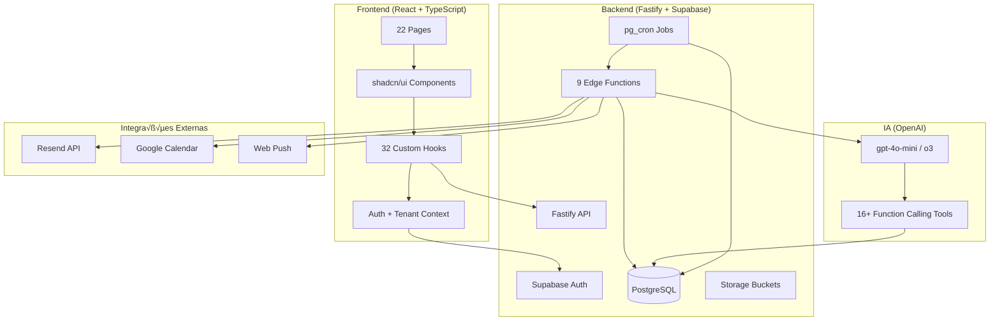
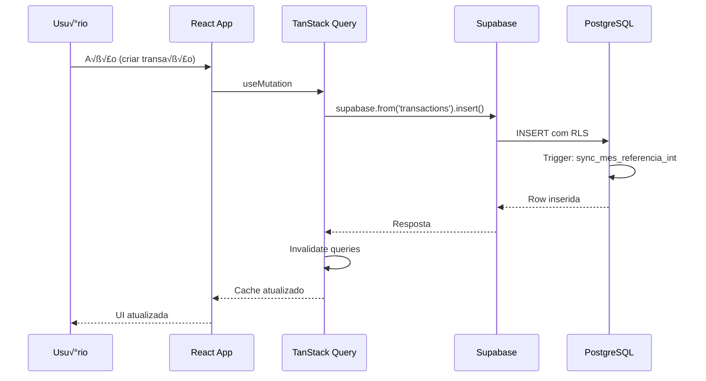
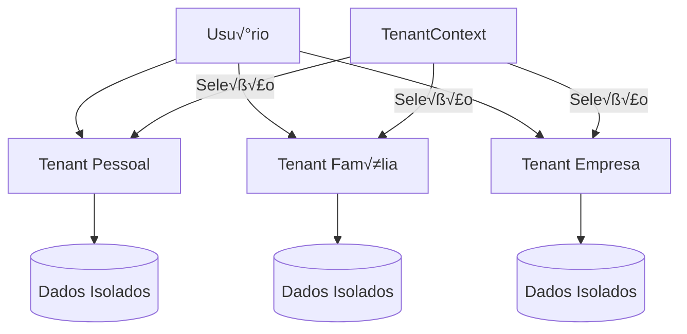
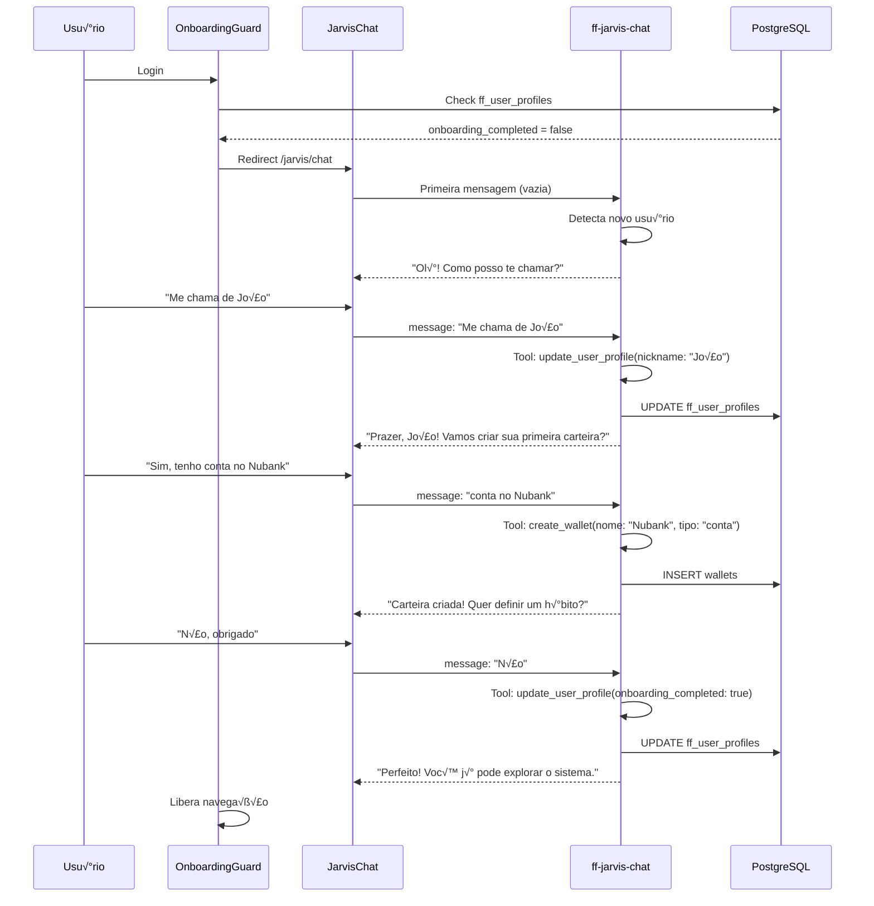
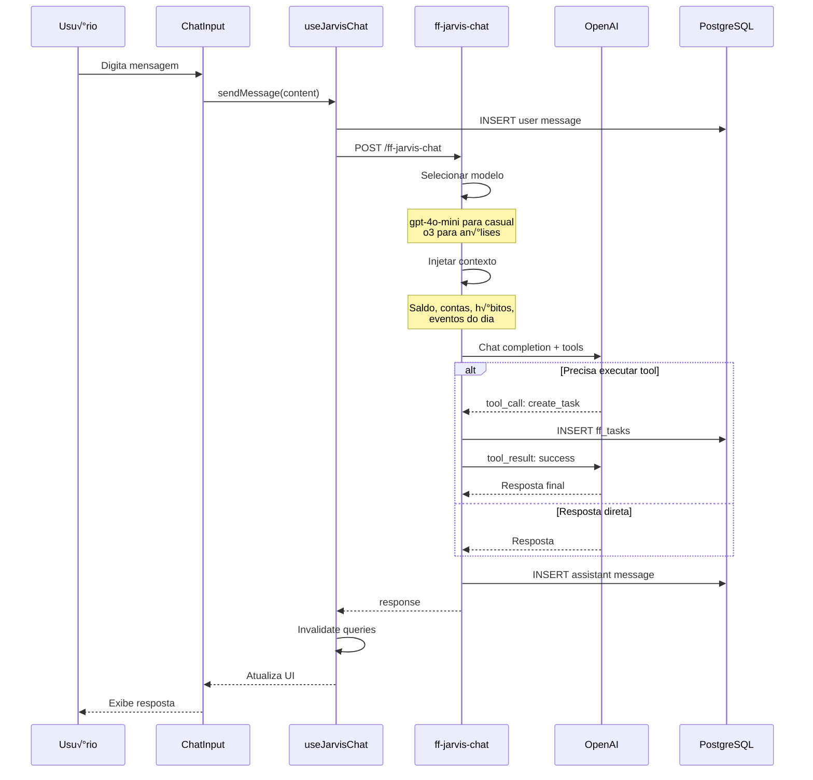
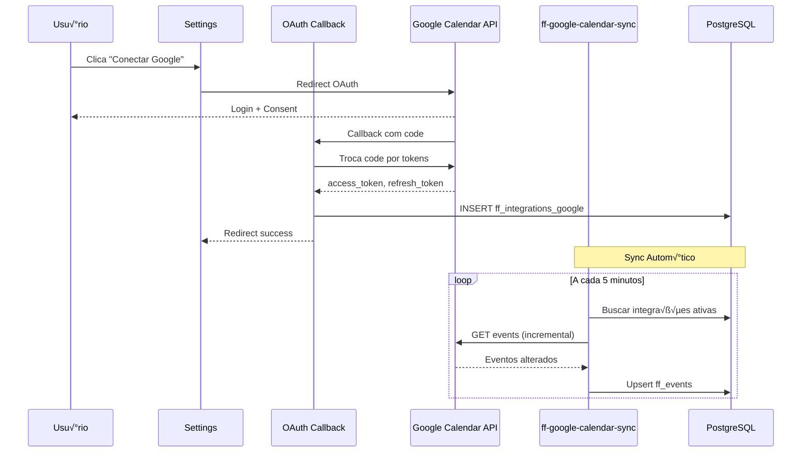

# 📊 FRACTTO FLOW - Documentação Técnica Completa


> **"Suas Finanças, Peça por Peça"** - Plataforma completa de gestão financeira pessoal com assistente IA integrado

**URL Produção:** (definir domínio)

---

## üìã Sum√°rio

1. [Vis√£o Geral](#1-vis√£o-geral)
2. [Stack Tecnológico](#2-stack-tecnológico)
3. [Arquitetura do Sistema](#3-arquitetura-do-sistema)
4. [Estrutura de Diretórios](#4-estrutura-de-diretórios)
5. [Schema do Banco de Dados](#5-schema-do-banco-de-dados)
6. [Edge Functions](#6-edge-functions)
7. [Hooks Customizados](#7-hooks-customizados)
8. [Fluxos de Negócio](#8-fluxos-de-negócio)
9. [Segurança](#9-segurança)
10. [Padrões de Desenvolvimento](#10-padrões-de-desenvolvimento)
11. [Configurações](#11-configurações)
12. [Troubleshooting](#12-troubleshooting)
13. [Documentos de Apoio](#13-documentos-de-apoio)

---

## 1. Vis√£o Geral

### 1.1 Propósito

FRACTTO FLOW é uma plataforma SaaS de gestão financeira pessoal com assistente IA integrado que permite aos usuários:

- Controlar receitas e despesas (simples, parceladas e recorrentes)
- Gerenciar carteiras (contas bancárias e cartões de crédito)
- Acompanhar faturas de cart√£o com ciclo autom√°tico
- Definir orçamentos mensais por categoria com políticas de rollover
- Estabelecer metas financeiras com contribuições
- Gerenciar investimentos (RF, RV, Fundos)
- Importar extratos banc√°rios via CSV
- Gerar relatórios e exportar para PDF/CSV
- Receber alertas por email sobre vencimentos e orçamentos
- **Conversar com GUTA** (assistente IA para produtividade e finanças)

### 1.2 Características Principais

| Feature | Descrição |
|---------|-----------|
| Multi-tenant | Cada usuário vê apenas seus dados (RLS) + workspaces isolados |
| Offline-ready | TanStack Query com cache persistente |
| Responsivo | Mobile-first design |
| Timezone-aware | Fixo em America/Sao_Paulo |
| Período fechado | Bloqueia edições retroativas |
| Assistente IA | Chat inteligente com function calling |
| Onboarding IA | Configuração guiada por chat |

### 1.3 Módulos do Sistema

#### 1.3.1 Módulo Finanças
Gestão completa de finanças pessoais: transações, carteiras, orçamentos, metas, investimentos, faturas de cartão e relatórios.

#### 1.3.2 Módulo GUTA (Assistente IA)
Assistente pessoal inteligente com:
- **Chat IA**: Conversa natural com entendimento de contexto financeiro
- **Tarefas**: Gest√£o de to-dos com prioridades, tags e datas
- **Eventos**: Calendário com integração Google Calendar
- **H√°bitos**: Tracking di√°rio/semanal com metas configur√°veis
- **Lembretes**: Notificações push
- **Memória**: Armazenamento de informações pessoais e preferências
- **Onboarding Guiado**: Configuração inicial humanizada

---

## 2. Stack Tecnológico

### 2.1 Frontend

```yaml
Framework: React 18.3.1
Linguagem: TypeScript 5.x
Build Tool: Vite 5.x
Estilização:
  - Tailwind CSS 3.x
  - shadcn/ui (50+ componentes)
  - Lucide React (ícones)
Estado:
  - TanStack Query 5.x (server state)
  - React Context (auth + tenant state)
Roteamento: React Router DOM 6.30.1
Formul√°rios:
  - React Hook Form 7.x
  - Zod 3.x (validação)
  - @hookform/resolvers
Gr√°ficos: Recharts 2.15.4
PDF: jsPDF + jspdf-autotable
Datas: date-fns 4.1.0
Notificações: Sonner 1.7.x
Markdown: react-markdown 10.x
```

### 2.2 Backend (Self-hosted + Supabase)

```yaml
Banco de Dados: PostgreSQL 15+ (Supabase)
Autenticação: Supabase Auth (JWT)
API: Fastify (Node.js) + Prisma
Edge Functions: Deno Runtime (Supabase)
Storage: Supabase Storage
Automação: pg_cron
Email: Resend API
Push: Web Push (VAPID)
```

### 2.3 IA e Modelos

```yaml
Orquestrador: OpenAI API
Modelos Disponíveis:
  - gpt-4o-mini: Chat casual, onboarding (~70% das interações)
  - gpt-4o: Mensagens com imagens/documentos (~10%)
  - o3: An√°lises complexas, planejamento financeiro (~20%)
Function Calling: 16+ tools para ações no sistema
Seleção Dinâmica: Baseada em complexidade da mensagem
```

### 2.4 Dependências Principais

```json
{
  "@supabase/supabase-js": "^2.76.1",
  "@tanstack/react-query": "^5.83.0",
  "date-fns": "^4.1.0",
  "react-hook-form": "^7.61.1",
  "react-markdown": "^10.1.0",
  "recharts": "^2.15.4",
  "zod": "^3.25.76",
  "jspdf": "^2.5.2",
  "lucide-react": "^0.462.0"
}
```

---

## 3. Arquitetura do Sistema

### 3.1 Diagrama de Arquitetura


```mermaid
graph TB
    subgraph Frontend["Frontend (React + TypeScript)"]
        UI[shadcn/ui Components]
        Pages[22 Pages]
        Hooks[32 Custom Hooks]
        Context[Auth + Tenant Context]
    end
    
    subgraph Backend["Backend (Fastify + Supabase)"]
        Auth[Supabase Auth]
        API[Fastify API]
        DB[(PostgreSQL)]
        Edge[9 Edge Functions]
        Storage[Storage Buckets]
        Cron[pg_cron Jobs]
    end
    
    subgraph AI["IA (OpenAI)"]
        GPT[gpt-4o-mini / o3]
        Tools[16+ Function Calling Tools]
    end
    
    subgraph External["Integrações Externas"]
        Resend[Resend API]
        Google[Google Calendar]
        Push[Web Push]
    end
    
    UI --> Hooks
    Hooks --> Context
    Context --> Auth
    Hooks --> API
    Edge --> DB
    Edge --> GPT
    GPT --> Tools
    Tools --> DB
    Edge --> Resend
    Edge --> Google
    Edge --> Push
    Cron --> DB
    Cron --> Edge
    Pages --> UI
```

### 3.2 Fluxo de Dados


```mermaid
sequenceDiagram
    participant U as Usu√°rio
    participant R as React App
    participant TQ as TanStack Query
    participant S as Supabase
    participant DB as PostgreSQL
    
    U->>R: Ação (criar transação)
    R->>TQ: useMutation
    TQ->>S: supabase.from('transactions').insert()
    S->>DB: INSERT com RLS
    DB->>DB: Trigger: sync_mes_referencia_int
    DB-->>S: Row inserida
    S-->>TQ: Resposta
    TQ->>TQ: Invalidate queries
    TQ-->>R: Cache atualizado
    R-->>U: UI atualizada
```

### 3.3 Arquitetura Multi-tenant

O sistema suporta m√∫ltiplos workspaces (tenants) por usu√°rio:


```mermaid
graph TD
    A[Usu√°rio] --> B[Tenant Pessoal]
    A --> C[Tenant Família]
    A --> D[Tenant Empresa]
    
    B --> E[(Dados Isolados)]
    C --> F[(Dados Isolados)]
    D --> G[(Dados Isolados)]
    
    H[TenantContext] --> |Seleção| B
    H --> |Seleção| C
    H --> |Seleção| D
```

**Tabelas relacionadas:**
- `tenants`: Definição de workspaces
- `tenant_members`: Membros de cada tenant
- `ff_*`: Tabelas GUTA com `tenant_id`

---

## 4. Estrutura de Diretórios

```
fractto-flow/
│   └── plan.md                  # Roadmap de implementação
│   └── WHATSAPP_N8N_INTEGRATION.md
├── public/
│   ├── favicon.ico
│   ├── favicon.svg
│   ├── manifest.json            # PWA manifest
│   ├── sw.js                    # Service Worker
│   └── robots.txt
├── src/
│   ├── App.tsx                  # Roteamento principal
│   ├── App.css                  # Estilos da aplicação
│   ├── main.tsx                 # Entry point
│   ├── index.css                # Estilos globais + Design tokens
│   │
│   ├── assets/
│   │   └── logo-fractto.png     # Logo da aplicação
│   │
│   ├── components/
│   │   ├── ui/                  # shadcn/ui (50+ componentes)
│   │   │
│   │   ├── budget/              # Orçamentos
│   │   ├── calendar/            # Calendário financeiro
│   │   ├── dashboard/           # Cards do dashboard
│   │   ├── faq/                 # FAQ interno
│   │   ├── forms/               # Inputs customizados
│   │   ├── goals/               # Metas financeiras
│   │   ├── import/              # Importação CSV
│   │   ├── investments/         # Investimentos
│   │   ├── landing/             # Landing page
│   │   ├── periods/             # Controle de períodos
│   │   ├── recurring/           # Transações recorrentes
│   │   ├── reports/             # Gráficos e relatórios
│   │   ├── settings/            # Configurações
│   │   ├── statements/          # Faturas de cartão
│   │   ├── transactions/        # Transações
│   │   ├── transfers/           # Transferências
│   │   ├── wallets/             # Carteiras
│   │   │
│   │   ├── jarvis/              # 🆕 Módulo GUTA
│   │   │   ├── chat/            # Chat IA
│   │   │   │   ├── ChatInput.tsx
│   │   │   │   ├── ChatMessage.tsx
│   │   │   │   ├── ChatSidebar.tsx
│   │   │   │   └── ChatWelcome.tsx
│   │   │   ├── home/            # Dashboard GUTA
│   │   │   │   ├── QuickSummaryCard.tsx
│   │   │   │   ├── TodayTasksCard.tsx
│   │   │   │   ├── UpcomingEventsCard.tsx
│   │   │   │   └── WeeklyHabitsCard.tsx
│   │   │   ├── settings/        # Configurações GUTA
│   │   │   │   ├── GoogleCalendarSection.tsx
│   │   │   │   └── WhatsAppSection.tsx
│   │   │   ├── ChatGPTImporter.tsx
│   │   │   ├── ConversationGroup.tsx
│   │   │   ├── DayEventGroup.tsx
│   │   │   ├── EventCard.tsx
│   │   │   ├── EventCardMinimal.tsx
│   │   │   ├── EventForm.tsx
│   │   │   ├── HabitCard.tsx
│   │   │   ├── HabitCardNectar.tsx
│   │   │   ├── HabitForm.tsx
│   │   │   ├── JarvisSidebar.tsx
│   │   │   ├── MemoryCard.tsx
│   │   │   ├── MemoryForm.tsx
│   │   │   ├── QuickAddInput.tsx
│   │   │   ├── QuickEventInput.tsx
│   │   │   ├── ReminderCard.tsx
│   │   │   ├── TaskCard.tsx
│   │   │   ├── TaskCardNectar.tsx
│   │   │   ├── TaskFilters.tsx
│   │   │   └── TaskForm.tsx
│   │   │
│   │   ├── layout/              # 🆕 Layouts (Unificado)
│   │   │   ├── UnifiedLayout.tsx    # Layout principal (use este!)
│   │   │   ├── UnifiedSidebar.tsx   # Sidebar unificada
│   │   │   ├── AppLayout.tsx        # [DEPRECATED]
│   │   │   ├── JarvisLayout.tsx     # [DEPRECATED]
│   │   │   ├── MainLayout.tsx       # [DEPRECATED]
│   │   │   ├── Sidebar.tsx          # [DEPRECATED]
│   │   │   └── Topbar.tsx
│   │   │
│   │   ├── tenant/              # 🆕 Multi-tenant
│   │   │   ├── TenantLoadingFallback.tsx
│   │   │   └── TenantSwitcher.tsx
│   │   │
│   │   ├── ErrorBoundary.tsx
│   │   ├── OnboardingGuard.tsx  # 🆕 Guard de onboarding
│   │   └── ProtectedRoute.tsx
│   │
│   ├── contexts/
│   │   ├── AuthContext.tsx
│   │   └── TenantContext.tsx    # 🆕 Context multi-tenant
│   │
│   ├── data/
│   │   └── faqData.ts
│   │
│   ├── hooks/
│   │   ├── use-mobile.tsx
│   │   ├── use-toast.ts
│   │   ├── useAlertSettings.ts
│   │   ├── useAutoStatement.ts
│   │   ├── useBudgets.ts
│   │   ├── useCalendar.ts
│   │   ├── useCardLimits.ts
│   │   ├── useCategories.ts
│   │   ├── useChatGPTImport.ts  # 🆕 Importar conversas ChatGPT
│   │   ├── useGoals.ts
│   │   ├── useGoogleIntegration.ts  # 🆕 Google Calendar
│   │   ├── useImporter.ts
│   │   ├── useInvestments.ts
│   │   ├── useJarvisChat.ts     # 🆕 Chat IA
│   │   ├── useJarvisEvents.ts   # 🆕 Eventos
│   │   ├── useJarvisHabits.ts   # 🆕 Hábitos
│   │   ├── useJarvisMemory.ts   # 🆕 Memória
│   │   ├── useJarvisReminders.ts # 🆕 Lembretes
│   │   ├── useJarvisTasks.ts    # 🆕 Tarefas
│   │   ├── useLeads.ts
│   │   ├── useOnboarding.ts     # 🆕 Onboarding IA
│   │   ├── usePaymentMethods.ts
│   │   ├── usePeriods.ts
│   │   ├── usePushSubscription.ts # 🆕 Push notifications
│   │   ├── useRecurringTransactions.ts
│   │   ├── useReports.ts
│   │   ├── useStatements.ts
│   │   ├── useTransactions.ts
│   │   ├── useTransfers.ts
│   │   ├── useUserPhone.ts      # 🆕 WhatsApp
│   │   ├── useUserSettings.ts
│   │   └── useWallets.ts
│   │
│   ├── integrations/
│   │   └── supabase/
│   │       ├── client.ts
│   │       └── types.ts         # Auto-gerado
│   │
│   ├── lib/
│   │   ├── budget.ts
│   │   ├── categoryMatcher.ts
│   │   ├── chatgptParser.ts     # 🆕 Parser de conversas
│   │   ├── csvParser.ts
│   │   ├── currency.ts
│   │   ├── date.ts
│   │   ├── deduplication.ts
│   │   ├── export.ts
│   │   ├── goals.ts
│   │   ├── jarvis-helpers.ts    # 🆕 Helpers GUTA
│   │   ├── masks.ts
│   │   ├── pdfGenerator.ts
│   │   ├── periodValidation.ts
│   │   ├── statementCycle.ts
│   │   ├── supabase.ts
│   │   ├── utils.ts
│   │   ├── validations.ts
│   │   └── webpush.ts           # 🆕 Web Push helpers
│   │
│   ├── pages/
│   │   ├── Auth.tsx
│   │   ├── Budget.tsx
│   │   ├── Calendar.tsx
│   │   ├── Categories.tsx
│   │   ├── Dashboard.tsx
│   │   ├── FAQ.tsx
│   │   ├── Goals.tsx
│   │   ├── Import.tsx
│   │   ├── Index.tsx
│   │   ├── Investments.tsx
│   │   ├── JarvisCalendar.tsx   # 🆕 Agenda GUTA
│   │   ├── JarvisChat.tsx       # 🆕 Chat IA
│   │   ├── JarvisDashboard.tsx  # 🆕 Dashboard GUTA
│   │   ├── JarvisHabits.tsx     # 🆕 Hábitos
│   │   ├── JarvisMemory.tsx     # 🆕 Memória
│   │   ├── JarvisReminders.tsx  # 🆕 Lembretes
│   │   ├── JarvisSettings.tsx   # 🆕 Configurações GUTA
│   │   ├── JarvisTasks.tsx      # 🆕 Tarefas
│   │   ├── Landing.tsx
│   │   ├── NotFound.tsx
│   │   ├── Reports.tsx
│   │   ├── Settings.tsx
│   │   ├── Transactions.tsx
│   │   ├── Transfers.tsx
│   │   └── Wallets.tsx
│   │
│   └── types/
│       ├── faq.ts
│       ├── jarvis.ts            # 🆕 Tipos GUTA
│       └── push-subscription.ts # 🆕 Tipos Push
│
├── supabase/
│   ├── config.toml
│   └── functions/
│       ├── cron-send-reminders/     # 🆕 Cron de lembretes
│       ├── ff-google-calendar-push/ # 🆕 Webhook Google
│       ├── ff-google-calendar-sync/ # 🆕 Sync bidirecional
│       ├── ff-google-oauth-callback/# 🆕 OAuth Google
│       ├── ff-jarvis-chat/          # 🆕 Chat IA com tools
│       ├── get-vapid-public-key/    # 🆕 VAPID keys
│       ├── process-reminders/       # 🆕 Processador de lembretes
│       ├── send-alerts/
│       └── send-push-test/          # 🆕 Teste de push
│
├── README.md
├── OPERATIONS.md
├── JORNADA_CLIENTE.md
├── APRESENTACAO_COMERCIAL.md
└── DOCUMENTATION.md             # Esta documentação
```

---

## 5. Schema do Banco de Dados

### 5.1 Diagrama ER Principal


```mermaid
erDiagram
    profiles ||--o{ transactions : "user_id"
    profiles ||--o{ categories : "user_id"
    profiles ||--o{ wallets : "user_id"
    profiles ||--o{ budgets : "user_id"
    profiles ||--o{ goals : "user_id"
    profiles ||--o{ investments : "user_id"
    profiles ||--o{ transfers : "user_id"
    profiles ||--o{ recurring_transactions : "user_id"
    profiles ||--o{ card_statements : "user_id"
    profiles ||--o{ periods : "user_id"
    profiles ||--o{ user_settings : "user_id"
    profiles ||--o{ alert_settings : "user_id"
    
    tenants ||--o{ tenant_members : "tenant_id"
    tenants ||--o{ ff_user_profiles : "tenant_id"
    tenants ||--o{ ff_tasks : "tenant_id"
    tenants ||--o{ ff_events : "tenant_id"
    tenants ||--o{ ff_habits : "tenant_id"
    tenants ||--o{ ff_reminders : "tenant_id"
    tenants ||--o{ ff_memory_items : "tenant_id"
    tenants ||--o{ ff_conversations : "tenant_id"
    
    ff_habits ||--o{ ff_habit_logs : "habit_id"
    ff_conversations ||--o{ ff_conversation_messages : "conversation_id"
    
    categories ||--o{ transactions : "category_id"
    categories ||--o{ budgets : "category_id"
    wallets ||--o{ transactions : "wallet_id"
    wallets ||--o{ card_statements : "wallet_id"
    goals ||--o{ goals_contribs : "goal_id"
    investments ||--o{ investment_contribs : "investment_id"
    card_statements ||--o{ card_statement_lines : "statement_id"
```

### 5.2 Tabelas Financeiras

*(Mantém documentação existente das tabelas: profiles, transactions, categories, wallets, budgets, goals, goals_contribs, investments, investment_contribs, transfers, card_statements, card_statement_lines, recurring_transactions, recurring_transaction_history, periods, payment_methods, user_settings, alert_settings, alert_log, import_history, import_presets, leads)*

### 5.3 Tabelas GUTA (Novas)

#### 5.3.1 tenants

Workspaces isolados para multi-tenancy.

```sql
CREATE TABLE public.tenants (
    id UUID PRIMARY KEY DEFAULT gen_random_uuid(),
    name TEXT NOT NULL,
    created_by UUID NOT NULL,
    created_at TIMESTAMPTZ DEFAULT now(),
    updated_at TIMESTAMPTZ DEFAULT now()
);
```

---

#### 5.3.2 tenant_members

Membros de cada tenant.

```sql
CREATE TABLE public.tenant_members (
    id UUID PRIMARY KEY DEFAULT gen_random_uuid(),
    tenant_id UUID NOT NULL REFERENCES tenants(id),
    user_id UUID NOT NULL,
    role TEXT DEFAULT 'member', -- 'owner' | 'admin' | 'member'
    created_at TIMESTAMPTZ DEFAULT now(),
    UNIQUE (tenant_id, user_id)
);
```

---

#### 5.3.3 ff_user_profiles

Perfil do usuário na GUTA (onboarding + preferências).

```sql
CREATE TABLE public.ff_user_profiles (
    id UUID PRIMARY KEY DEFAULT gen_random_uuid(),
    user_id UUID NOT NULL,
    tenant_id UUID NOT NULL REFERENCES tenants(id),
    nickname TEXT,
    full_name TEXT,
    birth_date DATE,
    locale TEXT DEFAULT 'pt-BR',
    timezone TEXT DEFAULT 'America/Sao_Paulo',
    preferences JSONB DEFAULT '{}',
    onboarding_completed BOOLEAN DEFAULT false,
    onboarding_step TEXT, -- 'welcome' | 'profile' | 'wallet_setup' | 'first_habit' | 'complete'
    interaction_count INTEGER DEFAULT 0,
    last_interaction_at TIMESTAMPTZ,
    created_at TIMESTAMPTZ DEFAULT now(),
    updated_at TIMESTAMPTZ DEFAULT now(),
    UNIQUE (user_id, tenant_id)
);
```

**Campos de onboarding:**
- `onboarding_completed`: Se o usu√°rio finalizou o setup guiado
- `onboarding_step`: Etapa atual do onboarding

---

#### 5.3.4 ff_tasks

Tarefas do usu√°rio.

```sql
CREATE TABLE public.ff_tasks (
    id UUID PRIMARY KEY DEFAULT gen_random_uuid(),
    tenant_id UUID NOT NULL REFERENCES tenants(id),
    created_by UUID NOT NULL,
    title TEXT NOT NULL,
    description TEXT,
    status TEXT DEFAULT 'pending', -- 'pending' | 'in_progress' | 'done' | 'cancelled'
    priority TEXT DEFAULT 'medium', -- 'low' | 'medium' | 'high' | 'urgent'
    due_at TIMESTAMPTZ,
    completed_at TIMESTAMPTZ,
    tags TEXT[] DEFAULT '{}',
    source TEXT DEFAULT 'web', -- 'web' | 'whatsapp' | 'google' | 'chat'
    created_at TIMESTAMPTZ DEFAULT now(),
    updated_at TIMESTAMPTZ DEFAULT now()
);
```

---

#### 5.3.5 ff_events

Eventos de calend√°rio.

```sql
CREATE TABLE public.ff_events (
    id UUID PRIMARY KEY DEFAULT gen_random_uuid(),
    tenant_id UUID NOT NULL REFERENCES tenants(id),
    created_by UUID NOT NULL,
    title TEXT NOT NULL,
    description TEXT,
    location TEXT,
    start_at TIMESTAMPTZ NOT NULL,
    end_at TIMESTAMPTZ,
    all_day BOOLEAN DEFAULT false,
    priority TEXT DEFAULT 'medium',
    status TEXT DEFAULT 'scheduled', -- 'scheduled' | 'completed' | 'cancelled'
    source TEXT DEFAULT 'web',
    google_event_id TEXT,          -- ID no Google Calendar
    google_calendar_id TEXT,       -- ID do calend√°rio
    created_at TIMESTAMPTZ DEFAULT now(),
    updated_at TIMESTAMPTZ DEFAULT now()
);
```

---

#### 5.3.6 ff_habits e ff_habit_logs

H√°bitos com tracking.

```sql
-- Definição do hábito
CREATE TABLE public.ff_habits (
    id UUID PRIMARY KEY DEFAULT gen_random_uuid(),
    tenant_id UUID NOT NULL REFERENCES tenants(id),
    created_by UUID NOT NULL,
    title TEXT NOT NULL,
    cadence TEXT DEFAULT 'daily', -- 'daily' | 'weekly'
    times_per_cadence INTEGER DEFAULT 1,
    target_type TEXT DEFAULT 'boolean', -- 'boolean' | 'count' | 'duration'
    target_value NUMERIC DEFAULT 1,
    active BOOLEAN DEFAULT true,
    created_at TIMESTAMPTZ DEFAULT now(),
    updated_at TIMESTAMPTZ DEFAULT now()
);

-- Logs de execução
CREATE TABLE public.ff_habit_logs (
    id UUID PRIMARY KEY DEFAULT gen_random_uuid(),
    habit_id UUID NOT NULL REFERENCES ff_habits(id) ON DELETE CASCADE,
    tenant_id UUID NOT NULL REFERENCES tenants(id),
    user_id UUID NOT NULL,
    log_date DATE NOT NULL DEFAULT CURRENT_DATE,
    value NUMERIC DEFAULT 1,
    created_at TIMESTAMPTZ DEFAULT now(),
    UNIQUE (habit_id, log_date)
);
```

---

#### 5.3.7 ff_reminders

Lembretes com notificações.

```sql
CREATE TABLE public.ff_reminders (
    id UUID PRIMARY KEY DEFAULT gen_random_uuid(),
    tenant_id UUID NOT NULL REFERENCES tenants(id),
    created_by UUID NOT NULL,
    title TEXT NOT NULL,
    remind_at TIMESTAMPTZ NOT NULL,
    channel TEXT DEFAULT 'push', -- 'push' | 'whatsapp' | 'email'
    status TEXT DEFAULT 'pending', -- 'pending' | 'sent' | 'failed' | 'dismissed'
    sent_at TIMESTAMPTZ,
    attempt_count INTEGER DEFAULT 0,
    last_attempt_at TIMESTAMPTZ,
    created_at TIMESTAMPTZ DEFAULT now(),
    updated_at TIMESTAMPTZ DEFAULT now()
);
```

---

#### 5.3.8 ff_memory_items

Memória persistente do usuário.

```sql
CREATE TABLE public.ff_memory_items (
    id UUID PRIMARY KEY DEFAULT gen_random_uuid(),
    tenant_id UUID NOT NULL REFERENCES tenants(id),
    user_id UUID NOT NULL,
    kind TEXT NOT NULL, -- 'preference' | 'fact' | 'note' | 'password' | 'contact'
    title TEXT,
    content TEXT NOT NULL,
    metadata JSONB DEFAULT '{}',
    source TEXT DEFAULT 'web',
    created_at TIMESTAMPTZ DEFAULT now(),
    updated_at TIMESTAMPTZ DEFAULT now()
);
```

---

#### 5.3.9 ff_conversations e ff_conversation_messages

Histórico de conversas com GUTA.

```sql
-- Sessões de conversa
CREATE TABLE public.ff_conversations (
    id UUID PRIMARY KEY DEFAULT gen_random_uuid(),
    tenant_id UUID NOT NULL REFERENCES tenants(id),
    user_id UUID NOT NULL,
    title TEXT,
    channel TEXT DEFAULT 'web', -- 'web' | 'whatsapp'
    created_at TIMESTAMPTZ DEFAULT now(),
    updated_at TIMESTAMPTZ DEFAULT now()
);

-- Mensagens
CREATE TABLE public.ff_conversation_messages (
    id UUID PRIMARY KEY DEFAULT gen_random_uuid(),
    conversation_id UUID NOT NULL REFERENCES ff_conversations(id) ON DELETE CASCADE,
    tenant_id UUID NOT NULL REFERENCES tenants(id),
    role TEXT NOT NULL, -- 'user' | 'assistant' | 'system' | 'tool'
    content TEXT NOT NULL,
    tool_calls JSONB,        -- Function calls do modelo
    tool_call_id TEXT,       -- ID da resposta de tool
    attachments JSONB,       -- Arquivos anexados
    created_at TIMESTAMPTZ DEFAULT now()
);
```

---

#### 5.3.10 ff_user_phones

Telefones para integração WhatsApp (planejada).

```sql
CREATE TABLE public.ff_user_phones (
    id UUID PRIMARY KEY DEFAULT gen_random_uuid(),
    user_id UUID NOT NULL,
    tenant_id UUID NOT NULL REFERENCES tenants(id),
    phone_e164 TEXT NOT NULL, -- Formato E.164: +5511999999999
    display_name TEXT,
    is_primary BOOLEAN DEFAULT true,
    verified_at TIMESTAMPTZ,   -- NULL = n√£o verificado
    created_at TIMESTAMPTZ DEFAULT now(),
    updated_at TIMESTAMPTZ DEFAULT now(),
    UNIQUE (phone_e164)
);
```

---

#### 5.3.11 ff_integrations_google

Tokens de integração Google Calendar.

```sql
CREATE TABLE public.ff_integrations_google (
    id UUID PRIMARY KEY DEFAULT gen_random_uuid(),
    user_id UUID NOT NULL,
    tenant_id UUID NOT NULL REFERENCES tenants(id),
    email TEXT,
    access_token TEXT,
    refresh_token TEXT,
    expiry TIMESTAMPTZ,
    scope TEXT,
    sync_token TEXT,           -- Para sync incremental
    last_sync_at TIMESTAMPTZ,
    created_at TIMESTAMPTZ DEFAULT now(),
    updated_at TIMESTAMPTZ DEFAULT now(),
    UNIQUE (user_id, tenant_id)
);
```

---

#### 5.3.12 ff_push_subscriptions

Subscriptions para Web Push.

```sql
CREATE TABLE public.ff_push_subscriptions (
    id UUID PRIMARY KEY DEFAULT gen_random_uuid(),
    user_id UUID NOT NULL,
    tenant_id UUID NOT NULL REFERENCES tenants(id),
    endpoint TEXT NOT NULL,
    p256dh TEXT NOT NULL,
    auth TEXT NOT NULL,
    user_agent TEXT,
    is_active BOOLEAN DEFAULT true,
    last_seen_at TIMESTAMPTZ,
    created_at TIMESTAMPTZ DEFAULT now(),
    updated_at TIMESTAMPTZ DEFAULT now(),
    UNIQUE (endpoint)
);
```

---

### 5.4 Views

*(Mantém views existentes: v_wallet_balance, v_monthly_summary, v_category_spending, v_balance_evolution)*

### 5.5 Funções PostgreSQL

*(Mantém funções existentes: fechar_mensal, reabrir_mensal, aplicar_rollover, realizado_categoria, process_recurring_transactions, close_card_statement, pay_card_statement)*

#### 5.5.6 ff_complete_task (Nova)

Marca tarefa como concluída.

```sql
CREATE FUNCTION ff_complete_task(p_task_id UUID)
RETURNS VOID AS $$
BEGIN
    UPDATE ff_tasks
    SET status = 'done',
        completed_at = now(),
        updated_at = now()
    WHERE id = p_task_id;
END;
$$ LANGUAGE plpgsql SECURITY DEFINER;
```

---

## 6. Edge Functions

### 6.1 send-alerts

Envia resumo financeiro di√°rio por email.
*(Documentação existente mantida)*

---

### 6.2 ff-jarvis-chat (Nova)

Chat IA com function calling para ações no sistema.

**Configuração:**
```toml
[functions.ff-jarvis-chat]
verify_jwt = true
```

**Endpoint:** `POST /functions/v1/ff-jarvis-chat`

**Payload:**
```typescript
{
  conversation_id?: string,   // ID da conversa (opcional, cria nova se n√£o informado)
  message: string,            // Mensagem do usu√°rio
  attachments?: Attachment[]  // Imagens, √°udios, documentos
}
```

**Fluxo:**
1. Resolver usu√°rio e tenant via JWT
2. Carregar ou criar conversa
3. Injetar contexto (saldo, contas a pagar, h√°bitos, eventos)
4. Selecionar modelo dinamicamente:
   - `gpt-4o-mini`: Chat casual, onboarding
   - `gpt-4o`: Mensagens com imagens
   - `o3`: An√°lises complexas
5. Executar function calling se necess√°rio
6. Salvar mensagens no histórico
7. Retornar resposta

**Function Calling Tools (16+):**
- `get_balance`: Consultar saldo de carteiras
- `get_upcoming_bills`: Contas a vencer
- `get_budget_status`: Status de orçamentos
- `create_transaction`: Criar transação
- `create_wallet`: Criar carteira
- `create_task`: Criar tarefa
- `update_task_status`: Atualizar status de tarefa
- `create_event`: Criar evento
- `create_habit`: Criar h√°bito
- `log_habit`: Registrar h√°bito do dia
- `create_reminder`: Criar lembrete
- `save_memory`: Salvar memória
- `search_memory`: Buscar na memória
- `update_user_profile`: Atualizar perfil/onboarding
- `get_today_summary`: Resumo do dia
- `get_financial_analysis`: An√°lise financeira

**Secrets:**
- `OPENAI_API_KEY`

---

### 6.3 ff-google-oauth-callback (Nova)

Callback do OAuth do Google Calendar.

**Endpoint:** `GET /functions/v1/ff-google-oauth-callback`

**Query params:**
- `code`: Authorization code do Google
- `state`: JSON com user_id e tenant_id

**Fluxo:**
1. Trocar code por access_token e refresh_token
2. Salvar tokens em ff_integrations_google
3. Redirecionar para settings

**Secrets:**
- `GOOGLE_CLIENT_ID`
- `GOOGLE_CLIENT_SECRET`

---

### 6.4 ff-google-calendar-sync (Nova)

Sincroniza eventos com Google Calendar.

**Endpoint:** `POST /functions/v1/ff-google-calendar-sync`

**Fluxo:**
1. Buscar integração ativa do usuário
2. Refresh token se expirado
3. Sync incremental usando syncToken
4. Criar/atualizar/deletar eventos locais

---

### 6.5 ff-google-calendar-push (Nova)

Webhook para push notifications do Google Calendar.

**Endpoint:** `POST /functions/v1/ff-google-calendar-push`

**Headers:**
- `X-Goog-Resource-ID`: ID do recurso
- `X-Goog-Channel-ID`: ID do canal

**Fluxo:**
1. Validar headers do Google
2. Enfileirar sync para o usu√°rio

---

### 6.6 get-vapid-public-key (Nova)

Retorna chave p√∫blica VAPID para Web Push.

**Endpoint:** `GET /functions/v1/get-vapid-public-key`

**Resposta:**
```json
{
  "publicKey": "BNxKj..."
}
```

---

### 6.7 send-push-test (Nova)

Envia push de teste para validar subscription.

**Endpoint:** `POST /functions/v1/send-push-test`

---

### 6.8 process-reminders (Nova)

Processa lembretes pendentes e envia notificações.

**Trigger:** Chamado pelo cron-send-reminders

---

### 6.9 cron-send-reminders (Nova)

Cron job para processar lembretes.

**Trigger:** Via pg_cron a cada minuto

---

## 7. Hooks Customizados

### 7.1 Hooks de Finanças

*(Mantém documentação existente: useTransactions, useBudgets, useWallets, useGoals, useInvestments, useRecurringTransactions, useStatements, usePeriods, useReports, useImporter, useCategories, usePaymentMethods, useTransfers, useCardLimits, useAlertSettings, useCalendar, useAutoStatement, useLeads, useUserSettings)*

### 7.2 Hooks GUTA (Novos)

#### 7.2.1 useJarvisChat

Chat IA com GUTA.

```typescript
interface UseJarvisChatReturn {
  // Estado
  conversations: Conversation[];
  currentConversation: Conversation | null;
  messages: Message[];
  isLoading: boolean;
  isSending: boolean;
  
  // Ações
  sendMessage: (content: string, attachments?: File[]) => Promise<void>;
  createConversation: () => Promise<string>;
  selectConversation: (id: string) => void;
  deleteConversation: (id: string) => Promise<void>;
  
  // Streaming
  streamingMessage: string | null;
}
```

---

#### 7.2.2 useJarvisTasks

CRUD de tarefas.

```typescript
interface UseJarvisTasksReturn {
  tasks: Task[];
  loading: boolean;
  
  // CRUD
  createTask: (data: TaskInput) => Promise<boolean>;
  updateTask: (id: string, data: Partial<TaskInput>) => Promise<boolean>;
  deleteTask: (id: string) => Promise<boolean>;
  
  // Ações rápidas
  completeTask: (id: string) => Promise<boolean>;
  reopenTask: (id: string) => Promise<boolean>;
  
  // Filtros
  filters: TaskFilters;
  setFilters: (filters: TaskFilters) => void;
  
  // Agrupados
  todayTasks: Task[];
  upcomingTasks: Task[];
  overdueTasks: Task[];
}
```

---

#### 7.2.3 useJarvisEvents

CRUD de eventos.

```typescript
interface UseJarvisEventsReturn {
  events: Event[];
  loading: boolean;
  
  // CRUD
  createEvent: (data: EventInput) => Promise<boolean>;
  updateEvent: (id: string, data: Partial<EventInput>) => Promise<boolean>;
  deleteEvent: (id: string) => Promise<boolean>;
  
  // Agrupados
  todayEvents: Event[];
  upcomingEvents: Event[];
  
  // Período
  dateRange: { start: Date; end: Date };
  setDateRange: (range: DateRange) => void;
}
```

---

#### 7.2.4 useJarvisHabits

CRUD de h√°bitos com logs.

```typescript
interface UseJarvisHabitsReturn {
  habits: Habit[];
  loading: boolean;
  
  // CRUD H√°bitos
  createHabit: (data: HabitInput) => Promise<boolean>;
  updateHabit: (id: string, data: Partial<HabitInput>) => Promise<boolean>;
  deleteHabit: (id: string) => Promise<boolean>;
  
  // Logs
  logHabit: (habitId: string, date?: Date, value?: number) => Promise<boolean>;
  unlogHabit: (habitId: string, date?: Date) => Promise<boolean>;
  
  // Status
  getHabitStatus: (habitId: string, date: Date) => HabitStatus;
  getWeeklyProgress: (habitId: string) => WeeklyProgress;
}
```

---

#### 7.2.5 useJarvisReminders

CRUD de lembretes.

```typescript
interface UseJarvisRemindersReturn {
  reminders: Reminder[];
  loading: boolean;
  
  // CRUD
  createReminder: (data: ReminderInput) => Promise<boolean>;
  updateReminder: (id: string, data: Partial<ReminderInput>) => Promise<boolean>;
  deleteReminder: (id: string) => Promise<boolean>;
  
  // Ações
  dismissReminder: (id: string) => Promise<boolean>;
  
  // Agrupados
  pendingReminders: Reminder[];
  sentReminders: Reminder[];
}
```

---

#### 7.2.6 useJarvisMemory

CRUD de memórias.

```typescript
interface UseJarvisMemoryReturn {
  memories: Memory[];
  loading: boolean;
  
  // CRUD
  saveMemory: (data: MemoryInput) => Promise<boolean>;
  updateMemory: (id: string, data: Partial<MemoryInput>) => Promise<boolean>;
  deleteMemory: (id: string) => Promise<boolean>;
  
  // Busca
  searchMemory: (query: string) => Memory[];
  
  // Por tipo
  getByKind: (kind: MemoryKind) => Memory[];
}
```

---

### 7.3 Hooks de Integrações (Novos)

#### 7.3.1 useGoogleIntegration

Integração com Google Calendar.

```typescript
interface UseGoogleIntegrationReturn {
  isConnected: boolean;
  email: string | null;
  lastSyncAt: Date | null;
  loading: boolean;
  
  // Ações
  connect: () => void; // Redireciona para OAuth
  disconnect: () => Promise<boolean>;
  sync: () => Promise<boolean>;
}
```

---

#### 7.3.2 useUserPhone

Gerenciamento de telefone WhatsApp (planejado).

```typescript
interface UseUserPhoneReturn {
  phone: UserPhone | null;
  loading: boolean;
  
  // CRUD
  setPhone: (phone: string) => Promise<boolean>;
  removePhone: () => Promise<boolean>;
  
  // Status
  isVerified: boolean;
}
```

---

#### 7.3.3 usePushSubscription

Gerenciamento de push notifications.

```typescript
interface UsePushSubscriptionReturn {
  subscription: PushSubscription | null;
  isSubscribed: boolean;
  loading: boolean;
  
  // Ações
  subscribe: () => Promise<boolean>;
  unsubscribe: () => Promise<boolean>;
  testPush: () => Promise<boolean>;
}
```

---

### 7.4 Hook de Onboarding (Novo)

#### 7.4.1 useOnboarding

Controle do fluxo de onboarding guiado por IA.

```typescript
interface UseOnboardingReturn {
  profile: UserProfile | null;
  loading: boolean;
  
  // Status
  needsOnboarding: boolean;
  currentStep: OnboardingStep | null;
  
  // Ações
  skipOnboarding: () => Promise<boolean>;
  
  // Progresso
  hasWallets: boolean;
}
```

---

## 8. Fluxos de Negócio

### 8.1-8.4 Fluxos Financeiros

*(Mantém documentação existente: Transações Simples/Parceladas/Recorrentes, Cartão de Crédito, Orçamentos, Importação CSV)*

### 8.5 Onboarding Guiado por IA (Novo)


```mermaid
sequenceDiagram
    participant U as Usu√°rio
    participant OG as OnboardingGuard
    participant C as JarvisChat
    participant AI as ff-jarvis-chat
    participant DB as PostgreSQL
    
    U->>OG: Login
    OG->>DB: Check ff_user_profiles
    DB-->>OG: onboarding_completed = false
    OG->>C: Redirect /jarvis/chat
    
    C->>AI: Primeira mensagem (vazia)
    AI->>AI: Detecta novo usu√°rio
    AI-->>C: "Ol√°! Como posso te chamar?"
    
    U->>C: "Me chama de Jo√£o"
    C->>AI: message: "Me chama de Jo√£o"
    AI->>AI: Tool: update_user_profile(nickname: "Jo√£o")
    AI->>DB: UPDATE ff_user_profiles
    AI-->>C: "Prazer, Jo√£o! Vamos criar sua primeira carteira?"
    
    U->>C: "Sim, tenho conta no Nubank"
    C->>AI: message: "conta no Nubank"
    AI->>AI: Tool: create_wallet(nome: "Nubank", tipo: "conta")
    AI->>DB: INSERT wallets
    AI-->>C: "Carteira criada! Quer definir um h√°bito?"
    
    U->>C: "N√£o, obrigado"
    C->>AI: message: "N√£o"
    AI->>AI: Tool: update_user_profile(onboarding_completed: true)
    AI->>DB: UPDATE ff_user_profiles
    AI-->>C: "Perfeito! Você já pode explorar o sistema."
    
    OG->>OG: Libera navegação
```

**Etapas do Onboarding:**
1. `welcome`: Boas-vindas e coleta do apelido
2. `profile`: Objetivos e preferências
3. `wallet_setup`: Criação da primeira carteira
4. `first_habit`: Sugest√£o de h√°bito (opcional)
5. `complete`: Finalização

---

### 8.6 Chat com GUTA (Novo)


```mermaid
sequenceDiagram
    participant U as Usu√°rio
    participant C as ChatInput
    participant H as useJarvisChat
    participant EF as ff-jarvis-chat
    participant AI as OpenAI
    participant DB as PostgreSQL
    
    U->>C: Digita mensagem
    C->>H: sendMessage(content)
    H->>DB: INSERT user message
    H->>EF: POST /ff-jarvis-chat
    
    EF->>EF: Selecionar modelo
    Note over EF: gpt-4o-mini para casual<br/>o3 para an√°lises
    
    EF->>EF: Injetar contexto
    Note over EF: Saldo, contas, h√°bitos,<br/>eventos do dia
    
    EF->>AI: Chat completion + tools
    
    alt Precisa executar tool
        AI-->>EF: tool_call: create_task
        EF->>DB: INSERT ff_tasks
        EF->>AI: tool_result: success
        AI-->>EF: Resposta final
    else Resposta direta
        AI-->>EF: Resposta
    end
    
    EF->>DB: INSERT assistant message
    EF-->>H: response
    H->>H: Invalidate queries
    H-->>C: Atualiza UI
    C-->>U: Exibe resposta
```

---

### 8.7 Google Calendar Sync (Novo)


```mermaid
sequenceDiagram
    participant U as Usu√°rio
    participant S as Settings
    participant O as OAuth Callback
    participant G as Google Calendar API
    participant Sync as ff-google-calendar-sync
    participant DB as PostgreSQL
    
    U->>S: Clica "Conectar Google"
    S->>G: Redirect OAuth
    G-->>U: Login + Consent
    G->>O: Callback com code
    O->>G: Troca code por tokens
    G-->>O: access_token, refresh_token
    O->>DB: INSERT ff_integrations_google
    O-->>S: Redirect success
    
    Note over Sync,DB: Sync Autom√°tico
    loop A cada 5 minutos
        Sync->>DB: Buscar integrações ativas
        Sync->>G: GET events (incremental)
        G-->>Sync: Eventos alterados
        Sync->>DB: Upsert ff_events
    end
```

---

## 9. Segurança

*(Mantém seções existentes: RLS, Soft Delete, Proteção de Período, Fingerprint, Validação de Cartão)*

### 9.6 Segurança GUTA (Novo)

#### RLS Multi-tenant
Todas as tabelas `ff_*` possuem RLS baseado em `tenant_id`:

```sql
CREATE POLICY "tenant_isolation" ON ff_tasks
    FOR ALL
    USING (tenant_id IN (
        SELECT tenant_id FROM tenant_members WHERE user_id = auth.uid()
    ));
```

---

## 10. Padrões de Desenvolvimento

### 10.1-10.5 Padrões Existentes

*(Mantém: Timezone, Moeda, Validação Zod, Toast, Componentes UI)*

### 10.6 Layout Unificado (Novo)

**SEMPRE usar `UnifiedLayout`** para novas p√°ginas:

```typescript
// ‚úÖ CORRETO
import { UnifiedLayout } from '@/components/layout/UnifiedLayout';

export default function MinhaPage() {
  return (
    <UnifiedLayout>
      <h1>Conte√∫do</h1>
    </UnifiedLayout>
  );
}

// ‚ùå DEPRECATED - N√£o usar
import { AppLayout } from '@/components/layout/AppLayout';
import { JarvisLayout } from '@/components/layout/JarvisLayout';
import { MainLayout } from '@/components/layout/MainLayout';
```

### 10.7 Multi-tenant Obrigatório (Novo)

**SEMPRE usar `TenantContext`** para dados isolados:

```typescript
import { useTenant } from '@/contexts/TenantContext';

function MeuComponente() {
  const { currentTenant, tenants } = useTenant();
  
  // Usar currentTenant.id em queries
  const { data } = useQuery({
    queryKey: ['items', currentTenant?.id],
    queryFn: () => supabase
      .from('ff_tasks')
      .select('*')
      .eq('tenant_id', currentTenant?.id)
  });
}
```

### 10.8 Seleção Dinâmica de Modelo (Novo)

A Edge Function `ff-jarvis-chat` seleciona o modelo automaticamente:

```typescript
function selectModel(
  message: string,
  hasImages: boolean,
  isNewUser: boolean,
  historyLength: number
): string {
  // Vision para imagens
  if (hasImages) return "gpt-4o";
  
  // Onboarding r√°pido
  if (isNewUser && historyLength < 10) return "gpt-4o-mini";
  
  // Detectar complexidade
  const complexPatterns = [
    /analis[ea]/i, /planej/i, /estrateg/i,
    /relat[oó]rio/i, /projec[aã]/i, /compar/i
  ];
  
  if (complexPatterns.some(p => p.test(message)) || message.length > 300) {
    return "o3";
  }
  
  return "gpt-4o-mini";
}
```

---

## 11. Configurações

*(Mantém seções existentes: Vite, Tailwind, TypeScript, shadcn/ui)*

### 11.5 Edge Functions (Atualizado)

```toml
# supabase/config.toml
project_id = "cqvrucgqubjwqvwvdplz"

[functions.send-alerts]
verify_jwt = false

[functions.ff-jarvis-chat]
verify_jwt = true

[functions.ff-google-oauth-callback]
verify_jwt = false

[functions.ff-google-calendar-sync]
verify_jwt = true

[functions.ff-google-calendar-push]
verify_jwt = false

[functions.get-vapid-public-key]
verify_jwt = false

[functions.send-push-test]
verify_jwt = true

[functions.process-reminders]
verify_jwt = false

[functions.cron-send-reminders]
verify_jwt = false
```

### 11.6 Secrets Necess√°rios

| Secret | Descrição | Obrigatório |
|--------|-----------|-------------|
| `OPENAI_API_KEY` | API key OpenAI para chat IA | ‚úÖ |
| `RESEND_API_KEY` | API key Resend para emails | ‚úÖ |
| `GOOGLE_CLIENT_ID` | OAuth Google | Se usar Calendar |
| `GOOGLE_CLIENT_SECRET` | OAuth Google | Se usar Calendar |
| `VAPID_PUBLIC_KEY` | Web Push | Se usar notificações |
| `VAPID_PRIVATE_KEY` | Web Push | Se usar notificações |

---

## 12. Troubleshooting

### 12.1 Problemas Existentes

*(Mantém: Data mostrando dia anterior, Transação não aparece no orçamento, Erro "Período fechado", Duplicata na importação, Fatura não fecha)*

### 12.2 Problemas GUTA (Novos)

#### Onboarding travado

**Causa:** `ff_user_profiles.onboarding_completed = false` mas usu√°rio n√£o quer continuar

**Solução:**
```sql
-- Via SQL
UPDATE ff_user_profiles 
SET onboarding_completed = true, onboarding_step = 'complete'
WHERE user_id = 'xxx';
```

Ou clicar em "Pular configuração" no chat.

---

#### WhatsApp (planejado)

Integração desativada no momento. Reimplementar ingest/verificação antes de habilitar no app.


#### Chat lento

**Causa:** Modelo `o3` sendo usado para chat casual

**Verificar:** Logs da Edge Function para ver qual modelo foi selecionado

**Esperado:**
- `gpt-4o-mini`: ~2s para respostas simples
- `o3`: ~15s para an√°lises complexas

---

#### Google Calendar n√£o sincroniza

**Verificar:**
1. `ff_integrations_google` tem tokens v√°lidos?
2. `expiry` n√£o passou?
3. Logs de erro na Edge Function

```sql
SELECT email, expiry, last_sync_at 
FROM ff_integrations_google 
WHERE user_id = 'xxx';
```

---

### 12.3 Logs e Debug

**Console do navegador:**
```typescript
// Verificar tenant atual
console.log(useTenant().currentTenant);

// Verificar queries GUTA
import { queryClient } from '@/lib/queryClient';
console.log(queryClient.getQueryCache().findAll({ queryKey: ['jarvis'] }));
```

**Edge Function logs:**
- Supabase ‚Üí Edge Functions ‚Üí [nome] ‚Üí Logs

---

## 13. Documentos de Apoio

| Documento | Descrição |
|-----------|-----------|
| [README.md](./README.md) | Vis√£o geral e setup inicial |
| [OPERATIONS.md](./OPERATIONS.md) | Procedimentos operacionais |
| [JORNADA_CLIENTE.md](./JORNADA_CLIENTE.md) | Jornada do usu√°rio |
| [APRESENTACAO_COMERCIAL.md](./APRESENTACAO_COMERCIAL.md) | Apresentação comercial |

---

## Changelog

### v2.0.0 (2026-02)
- ✅ **Módulo GUTA**: Chat IA, tarefas, eventos, hábitos, lembretes, memória
- ✅ **Onboarding Guiado por IA**: Configuração inicial via chat
- ✅ **Layout Unificado**: Sidebar única para GUTA + Finanças
- ‚úÖ **Multi-tenant**: Workspaces isolados
- ✅ **Integração Google Calendar**: Sync bidirecional
- ‚úÖ **Push Notifications**: Web Push para lembretes
- ✅ **Seleção Dinâmica de Modelo**: gpt-4o-mini / o3
- ‚úÖ **9 Edge Functions** (vs 2 anteriores)
- ‚úÖ **32 Custom Hooks** (vs 20 anteriores)

### v1.1.0 (2025-01)
- ✅ Correção de timezone em todo o sistema
- ✅ Limite de emergência para contas
- ✅ Documentação técnica completa

### v1.0.0 (2024-12)
- ✅ Release inicial em produção
- ‚úÖ Todas as features core implementadas
- ‚úÖ Security audit completo

---

## Contato

**Projeto:** FRACTTO FLOW  
**Vers√£o:** 2.0.0  
**URL:** (definir domínio)

---

*Documentação atualizada em 2026-02-02*
