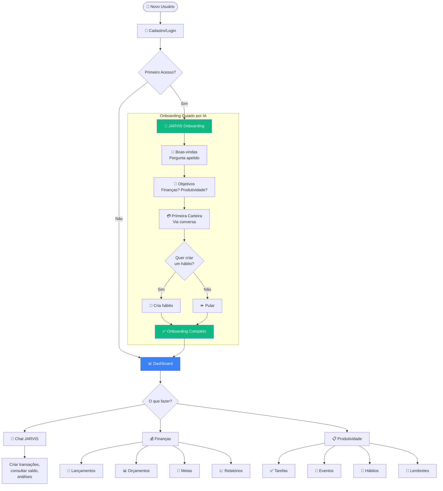

# Jornada do Cliente – Sistema de Controle Financeiro v2.0

## **Versão do Sistema**: 2.0.0  
**Última Atualização**: Fevereiro 2026

---

## **Visão Geral**

Este guia conduz novos usuários desde o cadastro inicial até o controle avançado de finanças pessoais **com assistente IA integrado**. O processo de onboarding agora é **guiado pelo JARVIS**, tornando a experiência mais fluida e personalizada.

---

## **Fluxograma da Jornada Completa**



---

## **1. Onboarding Guiado por IA** 🆕

### **1.1 Cadastro/Login**
- **Ação**: Criar conta com e-mail, senha e nome completo
- **Verificação**: Email de confirmação obrigatório
- **O que acontece automaticamente**:
  - Sistema cria perfil de usuário
  - Cria tenant (workspace) pessoal
  - Gera categorias e métodos de pagamento padrão

### **1.2 Boas-vindas do JARVIS**
- **Localização**: Após login, usuário é direcionado para `/jarvis/chat`
- **Experiência**:
  ```
  JARVIS: "Olá! Sou o JARVIS, seu assistente pessoal. 
          Vou te ajudar a configurar sua conta.
          Como posso te chamar?"
  
  Você: "Me chama de João"
  
  JARVIS: "Prazer, João! 🎉 
          Me conta, você quer organizar suas finanças, 
          sua produtividade, ou os dois?"
  ```

### **1.3 Configuração de Objetivos**
- JARVIS identifica necessidades:
  - 💰 Controle financeiro
  - 📋 Gestão de tarefas
  - 🔄 Tracking de hábitos
  - 📅 Organização de agenda
- Adapta sugestões baseado nas respostas

### **1.4 Criação da Primeira Carteira**
- **Via conversa natural**:
  ```
  JARVIS: "Para começar, vamos criar sua primeira carteira.
          Qual é seu banco principal?"
  
  Você: "Nubank"
  
  JARVIS: "Ótimo! É conta corrente ou cartão de crédito?"
  
  Você: "Conta corrente, tenho uns R$ 2.000 lá"
  
  JARVIS: "✅ Perfeito! Criei sua conta Nubank com saldo 
          inicial de R$ 2.000,00."
  ```

### **1.5 Sugestão de Primeiro Hábito**
- JARVIS sugere hábito baseado nos objetivos:
  - Se focou em finanças: "Registrar gastos diariamente"
  - Se focou em produtividade: "Revisar tarefas de manhã"
  - Se focou em saúde: "Beber 8 copos de água"
- Usuário pode aceitar ou pular

### **1.6 Finalização**
- JARVIS marca `onboarding_completed = true`
- Usuário tem acesso a todo o sistema
- Menu lateral é liberado

### **1.7 Pular Onboarding**
- Botão "Pular configuração" disponível a qualquer momento
- Se usuário já tem carteiras, sistema libera acesso automaticamente

---

## **2. Navegação Unificada** 🆕

### **2.1 Menu Lateral (Sidebar)**

O sistema agora possui uma **sidebar unificada** que agrupa todos os módulos:

```
┌─────────────────────────────┐
│ 🟢 FRACTTO FLOW             │
│ Suas finanças, peça por peça│
├─────────────────────────────┤
│ 🏢 [Tenant Switcher]        │
├─────────────────────────────┤
│ ASSISTENTE                  │
│ ├ 🧠 Início                 │
│ ├ 💬 Chat                   │
│ ├ ✅ Tarefas                │
│ ├ 📅 Agenda                 │
│ ├ 🔄 Hábitos                │
│ ├ 🔔 Lembretes              │
│ └ 💡 Memória                │
├─────────────────────────────┤
│ FINANÇAS                    │
│ ├ 📊 Dashboard              │
│ ├ 📝 Lançamentos            │
│ ├ 🏷️ Categorias             │
│ ├ 💳 Carteiras              │
│ ├ ↔️ Transferências          │
│ ├ 📅 Calendário             │
│ ├ 🎯 Orçamento              │
│ ├ 🏆 Metas                  │
│ ├ 📈 Investimentos          │
│ ├ 📉 Relatórios             │
│ ├ 📥 Importar               │
│ └ ❓ Ajuda (FAQ)            │
├─────────────────────────────┤
│ SISTEMA                     │
│ └ ⚙️ Configurações          │
├─────────────────────────────┤
│ 👤 usuario@email.com        │
│ [Sair]                      │
└─────────────────────────────┘
```

### **2.2 Tenant Switcher (Multi-workspace)**

Usuários podem ter múltiplos workspaces:
- **Pessoal**: Finanças e tarefas pessoais
- **Família**: Compartilhado com cônjuge
- **Empresa**: Para freelancers/autônomos

Cada workspace tem dados completamente isolados.

---

## **3. Usando o JARVIS**

### **3.1 Chat Inteligente**

**Localização**: Menu → Chat

**O que você pode fazer via chat:**

| Comando | Exemplo | Ação |
|---------|---------|------|
| Consultar saldo | "Qual meu saldo?" | Exibe saldo de todas as carteiras |
| Ver contas a pagar | "Tenho contas pra pagar?" | Lista vencimentos próximos |
| Criar transação | "Gastei 50 no almoço hoje" | Cria despesa de R$ 50 |
| Criar tarefa | "Lembrar de pagar IPTU amanhã" | Cria tarefa com data |
| Análise financeira | "Analisa meus gastos do mês" | Relatório detalhado |
| Salvar memória | "Senha do wifi é 12345" | Salva na memória |
| Registrar hábito | "Fiz exercício hoje" | Marca hábito do dia |

### **3.2 Tarefas**

**Localização**: Menu → Tarefas

- Criar tarefas com descrição, data e prioridade
- Filtros por status (pendente, em progresso, concluída)
- Ordenação por data ou prioridade
- Cards estilo Néctar (design minimalista)

### **3.3 Eventos (Agenda)**

**Localização**: Menu → Agenda

- Visualização em calendário mensal
- Criar eventos com horário e localização
- Sincronizar com Google Calendar
- Cores por tipo de evento

### **3.4 Hábitos**

**Localização**: Menu → Hábitos

- Criar hábitos diários ou semanais
- Tracking visual com checkmarks
- Estatísticas de streak
- Metas configuráveis (ex: 8 copos de água = 8 checks)

### **3.5 Lembretes**

**Localização**: Menu → Lembretes

- Criar lembretes com data/hora
- Receber notificação push no navegador
- Opcional: alerta via WhatsApp

### **3.6 Memória**

**Localização**: Menu → Memória

- Salvar informações importantes
- Tipos: preferência, fato, nota, senha, contato
- Busca rápida
- JARVIS acessa automaticamente em conversas

---

## **4. Integrações**

### **4.1 WhatsApp** 🆕

**Configuração**: Menu → Configurações → WhatsApp

1. Insira seu número no formato +55 11 99999-9999
2. Salve e envie "verificar" para o número do JARVIS
3. Após verificação, você pode:
   - Criar tarefas: "tarefa: comprar leite"
   - Registrar gastos: "gasto: 50 almoço"
   - Consultar saldo: "qual meu saldo?"

### **4.2 Google Calendar** 🆕

**Configuração**: Menu → Configurações → Google Calendar

1. Clique em "Conectar Google"
2. Faça login e autorize acesso
3. Eventos são sincronizados automaticamente
4. Sync bidirecional (cria no app → aparece no Google e vice-versa)

### **4.3 Notificações Push** 🆕

**Configuração**: Menu → Configurações → Notificações

1. Clique em "Ativar notificações"
2. Permita no navegador
3. Receba alertas de:
   - Lembretes
   - Contas a vencer
   - Tarefas atrasadas

---

## **5. Configuração de Carteiras** ⚠️ **Obrigatório antes de transações**

*(Mantém seção existente sobre carteiras e cartões)*

---

## **6. Lançamentos e Operações Básicas**

*(Mantém seções existentes sobre transações simples, parceladas, recorrentes e transferências)*

---

## **7. Orçamentos e Controle Mensal**

*(Mantém seções existentes sobre orçamentos, rollover e fechamento de períodos)*

---

## **8. Faturas de Cartão de Crédito**

*(Mantém seção existente)*

---

## **9. Importação de Extratos (CSV)**

*(Mantém seção existente)*

---

## **10. Metas e Investimentos**

*(Mantém seção existente)*

---

## **11. Relatórios e Análises**

*(Mantém seção existente)*

---

## **12. Alertas e Configurações**

*(Mantém seção existente + adicionar)*

### **12.5 Configurações do JARVIS** 🆕

**Localização**: Menu → Configurações

- **Idioma**: Português (padrão)
- **Timezone**: America/Sao_Paulo
- **Preferências de resposta**: Tom formal/informal

---

## **13. Rotina Recomendada**

### **13.1 Diária**
- [ ] Verificar dashboard no JARVIS
- [ ] Registrar hábitos
- [ ] Lançar transações do dia
- [ ] Marcar tarefas concluídas

### **13.2 Semanal**
- [ ] Revisar próximos eventos
- [ ] Verificar orçamentos
- [ ] Planejar semana seguinte

### **13.3 Mensal**
- [ ] Fechar período anterior
- [ ] Aplicar rollover de orçamentos
- [ ] Revisar metas
- [ ] Analisar relatórios
- [ ] Ajustar hábitos se necessário

---

## **14. Solução de Problemas Comuns**

### **Erro: Onboarding travado**
- **Causa**: Usuário fechou chat antes de finalizar
- **Solução**: Clicar em "Pular configuração" no chat

### **Erro: WhatsApp não funciona**
- **Verificar**:
  - Número está verificado?
  - Formato correto (+55...)?
- **Solução**: Enviar "verificar" novamente

### **Erro: Google Calendar não sincroniza**
- **Verificar**:
  - Conexão ainda ativa em Configurações?
- **Solução**: Desconectar e reconectar

### **Erro: Não recebo notificações**
- **Verificar**:
  - Navegador permitiu notificações?
  - Não está em modo privado/anônimo?
- **Solução**: Reativar em Configurações

*(Mantém demais erros existentes)*

---

## **15. Materiais de Apoio**

### **FAQ Integrado**
- Menu → Ajuda (FAQ)
- Busca por palavras-chave
- Artigos categorizados

### **Chat com JARVIS**
- Pergunte diretamente ao JARVIS
- "Como faço para importar CSV?"
- "Explica o rollover de orçamento"

---

## **Versão e Atualizações**

- **Versão atual**: 2.0.0
- **Data**: Fevereiro 2026
- **Próxima revisão**: Trimestral

### **Changelog v2.0**
- ✅ Onboarding guiado por IA (JARVIS)
- ✅ Menu lateral unificado
- ✅ Módulo de tarefas
- ✅ Módulo de eventos
- ✅ Módulo de hábitos
- ✅ Módulo de lembretes
- ✅ Módulo de memória
- ✅ Integração WhatsApp
- ✅ Integração Google Calendar
- ✅ Notificações push
- ✅ Multi-tenant (workspaces)

### **Changelog v1.1**
- ✅ Deduplicação automática em importações (fingerprint)
- ✅ Mensagens amigáveis para período fechado
- ✅ Otimização de consultas de orçamento (server-side)
- ✅ Proteção contra duplicação em faturas (índice único)
- ✅ Catch-up automático de recorrências atrasadas

---

## **Suporte e Contato**

Para dúvidas, problemas ou sugestões:
1. Pergunte ao JARVIS no chat
2. Consulte o FAQ no aplicativo
3. Verifique esta documentação

**Boas práticas**: Seguindo esta jornada estruturada, você terá controle total sobre suas finanças e produtividade, com a ajuda de um assistente IA sempre disponível!

---

*Jornada do Cliente atualizada em Fevereiro 2026*
