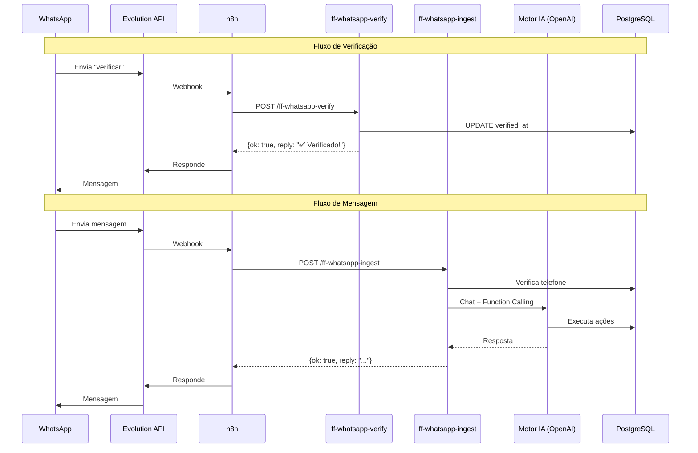

# FRACTTO FLOW - WhatsApp Integration (n8n) v2.0

## Visão Geral

Esta documentação descreve como integrar o FRACTTO FLOW com WhatsApp via n8n. O sistema usa **motor IA unificado** (mesmo do chat web), permitindo que usuários executem qualquer ação disponível no sistema via mensagem.

---

## Arquitetura



---

## Fluxo de Verificação

### 1. Vincular Telefone no App

O usuário acessa `/jarvis/settings` e insere seu número de WhatsApp no formato E.164 (ex: `+5511999999999`).

### 2. Verificar via WhatsApp

O usuário envia "verificar" para o número do JARVIS. O n8n recebe a mensagem e chama a Edge Function `ff-whatsapp-verify`.

---

## Edge Functions

### POST `/functions/v1/ff-whatsapp-verify`

Marca o telefone como verificado.

**Headers:**
```
Content-Type: application/json
x-n8n-token: <N8N_WEBHOOK_TOKEN>
```

**Request Body:**
```json
{
  "phone_e164": "+5511999999999"
}
```

**Response (sucesso):**
```json
{
  "ok": true,
  "reply": "✅ WhatsApp verificado com sucesso! Agora você pode criar tarefas, lembretes e mais enviando mensagens."
}
```

**Response (número não encontrado):**
```json
{
  "ok": false,
  "reply": "Número não encontrado. Vincule primeiro em fracttoflow.lovable.app/jarvis/settings"
}
```

---

### POST `/functions/v1/ff-whatsapp-ingest`

Recebe mensagens e processa via **motor IA unificado**.

**Headers:**
```
Content-Type: application/json
x-n8n-token: <N8N_WEBHOOK_TOKEN>
```

**Request Body:**
```json
{
  "phone_e164": "+5511999999999",
  "message_type": "text",
  "text": "mensagem do usuário",
  "message_id": "abc123",
  "sent_at": "2026-02-02T12:00:00Z"
}
```

**Response (sucesso):**
```json
{
  "ok": true,
  "reply": "✅ Tarefa criada: Comprar leite - vence amanhã",
  "actions_taken": ["create_task"]
}
```

**Response (número não verificado):**
```json
{
  "ok": false,
  "reply": "❌ Seu número não está verificado. Acesse fracttoflow.lovable.app/jarvis/settings para vincular e depois envie 'verificar' aqui."
}
```

---

## Motor IA Unificado 🆕

O `ff-whatsapp-ingest` **NÃO usa mais parsing por regex**. Em vez disso, usa o mesmo motor IA do chat web com acesso a **todos os 16+ tools** de function calling.

### Tools Disponíveis

| Tool | Exemplo de uso via WhatsApp |
|------|----------------------------|
| `get_balance` | "Qual meu saldo?" |
| `get_upcoming_bills` | "Tenho contas pra pagar?" |
| `create_transaction` | "Gastei 50 no almoço" |
| `create_task` | "Tarefa: ligar pro banco amanhã" |
| `update_task_status` | "Conclui a tarefa de pagar IPTU" |
| `create_event` | "Agenda reunião quinta às 14h" |
| `log_habit` | "Fiz exercício hoje" |
| `create_reminder` | "Me lembra de tomar remédio às 20h" |
| `save_memory` | "Senha do wifi é 12345" |
| `search_memory` | "Qual a senha do wifi?" |
| `get_financial_analysis` | "Analisa meus gastos do mês" |

### Contexto Injetado

O motor IA recebe automaticamente:
- Saldo das carteiras
- Contas a vencer (7 dias)
- Hábitos ativos
- Eventos do dia
- Tarefas pendentes

Isso permite respostas contextualizadas:
```
Usuário: "Como tô de grana?"
JARVIS: "Você tem R$ 3.450 no Nubank. Atenção: fatura do cartão 
         de R$ 1.200 vence em 3 dias."
```

---

## Histórico de Conversas

Mensagens do WhatsApp são persistidas em `ff_conversation_messages` com:
- `channel = 'whatsapp'`
- `tenant_id` do usuário
- Histórico completo de mensagens e tool calls

Isso permite:
- Continuidade de conversa entre web e WhatsApp
- Auditoria de ações executadas
- Contexto mantido entre mensagens

---

## Configuração no n8n

### 1. Webhook de Entrada

Configure um webhook no n8n para receber mensagens do Evolution API.

**Trigger:** Webhook → `POST /whatsapp-webhook`

### 2. Processar Mensagem

```javascript
// Node: Code
const message = $input.first().json;
const phone = message.data.key.remoteJid.replace('@s.whatsapp.net', '');
const text = message.data.message?.conversation || 
             message.data.message?.extendedTextMessage?.text || '';

// Normalizar para E.164
const phone_e164 = phone.startsWith('+') ? phone : `+${phone}`;

return {
  phone_e164,
  message_type: 'text',
  text,
  message_id: message.data.key.id,
  sent_at: new Date().toISOString()
};
```

### 3. Decidir Rota

```javascript
// Node: If
const text = $input.first().json.text.toLowerCase().trim();

if (text === 'verificar') {
  return { route: 'verify' };
}
return { route: 'ingest' };
```

### 4. Chamar Edge Functions

**Para verificação:**
```
HTTP Request → POST
URL: https://uyeqdokcwmcxuxuwwjnj.supabase.co/functions/v1/ff-whatsapp-verify
Headers:
  Content-Type: application/json
  x-n8n-token: {{ $env.N8N_WEBHOOK_TOKEN }}
Body: {
  "phone_e164": "{{ $json.phone_e164 }}"
}
```

**Para ingestão:**
```
HTTP Request → POST
URL: https://uyeqdokcwmcxuxuwwjnj.supabase.co/functions/v1/ff-whatsapp-ingest
Headers:
  Content-Type: application/json
  x-n8n-token: {{ $env.N8N_WEBHOOK_TOKEN }}
Body: {{ $json }}
```

### 5. Responder

Use o campo `reply` da resposta para enviar mensagem de volta via Evolution API.

---

## Segurança

1. **Token n8n**: Todas as requisições devem incluir header `x-n8n-token` com o valor do secret `N8N_WEBHOOK_TOKEN`

2. **Verificação**: Apenas telefones verificados podem executar ações

3. **Multi-tenant**: Todo item criado usa o `tenant_id` do usuário resolvido pelo telefone

4. **RLS**: Tabela `ff_user_phones` protegida por Row Level Security

---

## URLs de Produção

```
POST https://uyeqdokcwmcxuxuwwjnj.supabase.co/functions/v1/ff-whatsapp-verify
POST https://uyeqdokcwmcxuxuwwjnj.supabase.co/functions/v1/ff-whatsapp-ingest
```

---

## Troubleshooting

### Mensagens não são processadas

1. Verificar se telefone está cadastrado:
   ```sql
   SELECT * FROM ff_user_phones WHERE phone_e164 = '+55...';
   ```

2. Verificar se está verificado:
   ```sql
   SELECT verified_at FROM ff_user_phones WHERE phone_e164 = '+55...';
   -- NULL = não verificado
   ```

3. Verificar logs da Edge Function:
   - Lovable Cloud → Edge Functions → ff-whatsapp-ingest → Logs

### Respostas lentas

O motor IA usa seleção dinâmica de modelo:
- Chat casual: `gpt-4o-mini` (~2s)
- Análises complexas: `o3` (~15s)

Se todas as respostas estão lentas, verificar se o contexto está muito grande.

### Erro de token

```json
{"ok": false, "error": "Unauthorized"}
```

Verificar se `N8N_WEBHOOK_TOKEN` está configurado corretamente em:
1. Secret do Lovable Cloud
2. Variável de ambiente do n8n

---

## Changelog

### v2.0 (Fevereiro 2026)
- ✅ Motor IA unificado (mesmo do chat web)
- ✅ Suporte a todos os 16+ tools
- ✅ Histórico persistido em ff_conversation_messages
- ✅ Contexto injetado automaticamente
- ❌ Removido: parsing por regex/prefixos

### v1.0 (Janeiro 2026)
- ✅ Verificação de telefone
- ✅ Parsing por prefixos (tarefa:, lembrete:, etc.)
- ✅ Criação básica de itens
